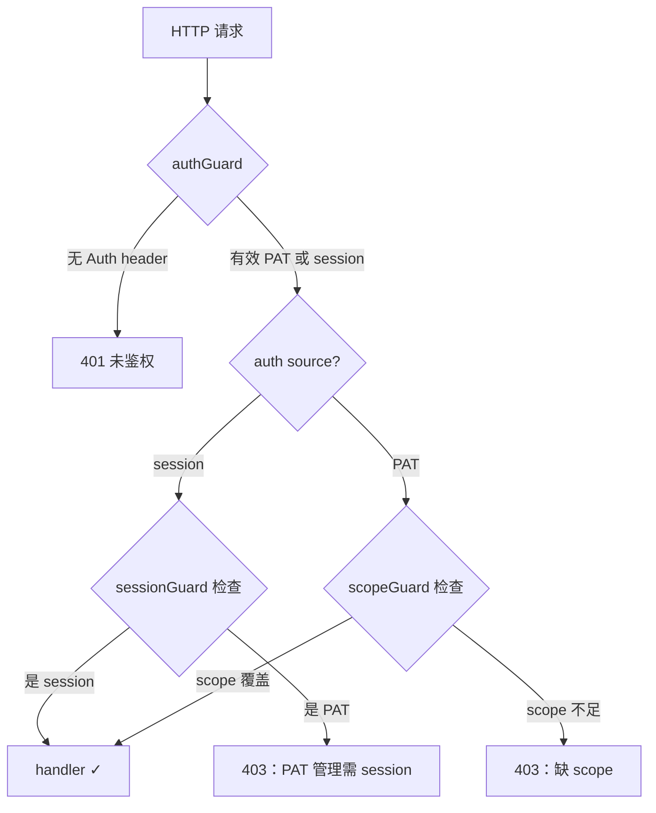

# 鉴权模型

QuantumAtlas 的鉴权回答两个问题：

1. **你是谁？**（authentication）
2. **你能做什么？**（authorization）

这两件事在系统里由不同的层处理。理解清楚能避免很多"我有 token 啊为什么 403"的疑惑。

## 三种身份载体

| 载体 | 谁能拥有 | 寿命 | 怎么获得 | 隐式 scope |
|---|---|---|---|---|
| **PocketBase session** | 浏览器登录用户 | 默认 14 天，自动续期 | GitHub OAuth 登录后，浏览器自动持有（`pb.authStore`，不需要复制） | `*`（全权限）|
| **PAT (Personal Access Token)** | 任何登录用户 | 1–365 天 | 在 `/pat` 页面创建 | 显式 opt-in，**默认空集 = 不能写**|
| **System PAT**（可选，运维兜底）| ops（写 `.env` 的人）| 永不过期，rotation = 改 env+restart | 在 server 的 `.env` 写 `QATLAS_SYSTEM_PAT=<plaintext>` | 默认 `*`，可通过 `QATLAS_SYSTEM_PAT_SCOPES` 限缩 |
| **匿名** | 任何人 | — | 不带 `Authorization` 头 | 仅 health / meta / share 短链等无数据端点 |

!!! tip "三种 token 怎么选？"

    - **Session**：浏览器里自动用（基本无感）；**没有 UI 入口让你 copy 它**——非浏览器用例改用下面两种
    - **PAT**：CLI / 人工脚本 / 想钉到具体人身份的 ingest 工具——最常见的"我手里有个写权限 token"
    - **System PAT**：CI / cron / pb_data 出问题时的 breaking glass——env 加载，跟 PocketBase 完全解耦

PAT 明文以 `qat_` 开头，**只在创建时显示一次**，server 只存 bcrypt 哈希。丢了就只能 revoke + 重建。

System PAT 明文格式随意（推荐 `openssl rand -base64 32`），**只活在进程内存 + .env 里**，server 不持久化也不哈希。详见 [§System PAT](#system-pat-运维专用-breaking-glass-token)。

## Scope 词表

PAT 携带一组显式 scope（GitHub fine-grained PAT 同款设计）。当前词表：

| Scope | 覆盖端点 |
|---|---|
| `wiki:read` | `GET /api/pages` `GET /api/pages/{id}` `GET /api/stats` `GET /api/search` `GET /api/lint` `GET /api/wiki/sync/status` |
| `papers:read` | `GET /api/papers/{path...}`（资产下载、stats、resources、markdown）|
| `papers:write` | `POST /api/papers/{id}/upload-pdf` `POST /api/papers/{id}/upload-markdown` `POST /api/papers/{id}/mineru-claim` `DELETE /api/papers/{id}/mineru-claim/{cid}`（隐式含 `papers:read`）|
| `shares:read` | `GET /api/shares/` |
| `shares:write` | `POST /api/shares/`、`DELETE /api/shares/{token}`（隐式含 `shares:read`）|
| `graph:read` | `GET /api/graph/stats` `GET /api/graph/schema` `POST /api/graph/query`（含只读 Cypher）|
| `wiki:write` | `POST /api/wiki/sync/pull`（服务端 git fast-forward + 缓存刷新；隐式含 `wiki:read`）|

**Scope 是编译时静态的**——加新 scope 需要改代码 + 重新部署。完整词表在 `internal/pat/scopes.go`。

!!! warning "PAT 默认空集 = 什么都调不了"
    创建 PAT 时**至少要勾一个 scope**，否则该 PAT 调任何端点（读或写）都是 403。知识库**不再匿名可读**——浏览页面、搜索、下载 PDF、查图谱都需要 session token，或带相应 `*:read` scope 的 PAT。仅 health / server-info / share 短链 / 安装脚本 / SPA 外壳 这几个无数据端点保持公开。

## 端点的三种门禁

服务端有三层门禁，写在 `internal/routes/auth.go` 和 `internal/routes/scope_guard.go`：



- **`authGuard`** — 只要有效凭据就放行；少数无数据公开端点（health / server-info / share / 安装脚本 / SPA）不挂这层。
- **`scopeGuard(obj, act)`** — 在 `authGuard` 之上再检查 PAT 是否包含覆盖 `(obj, act)` 的 scope。**session 自动 bypass**（它有隐式 `*`）。所有读口（`*:read`）和写口（`*:write`）都挂这层。
- **`sessionGuard`** — 比 `authGuard` 更严，**显式拒绝 PAT auth**。只用在 `/api/pat` 自己（PAT 管理只能浏览器做）—— 防止 leaked PAT 自我复制。

## 哪些端点要鉴权

完整清单在 [REST API 参考](../reference/rest-api.md)。粗略分布：

| 类别 | 鉴权 |
|---|---|
| Wiki 读 (`/api/pages`、`/api/search`、`/api/stats`、`/api/lint`、`/api/wiki/sync/status`) | `authGuard + wiki:read` |
| Graph 读 (`/api/graph/stats`、`/api/graph/schema`、`POST /api/graph/query`) | `authGuard + graph:read` |
| 论文资产下载 (`GET /api/papers/{path...}`) | `authGuard + papers:read` |
| Health / Meta (`/api/health`、`/api/server/info`、`/api/pat/scopes`、`/install-server.sh`、`/swagger/*`、SPA `/{path...}`) | **公开**（无数据 / bootstrap / 外壳）|
| Share 读 (`/share/{token}/*`) | **公开**（share token 自带授权）|
| 论文上传 / mineru 相关 | `authGuard + papers:write` |
| Wiki 同步 (`POST /api/wiki/sync/pull`) | `authGuard + wiki:write` |
| Share 创建 / 列表 / 撤销 | `authGuard + shares:{read,write}` |
| **PAT 管理** (`/api/pat`) | `sessionGuard`（拒 PAT）|

设计原则：**凡是返回语料数据的端点（读和写）都要鉴权**；只有"无数据"的探活 / 版本 / 安装脚本 / 文档 / SPA 外壳，以及"凭据自带授权"的 share 短链保持公开。知识库不再匿名可读。

!!! note "Graph 查询：同 scope 下危害最大的那一档"
    `graph:read` 同时覆盖 `stats` / `schema`（server 自算的固定形状聚合）和 `POST /api/graph/query`。三者都要鉴权，但 `query` 风险最高：它执行调用方提供的 Cypher。查询**只读**（驱动层 `ExecuteRead` 拒绝写），但**故意不加查询代价上限**：过了 `graph:read` 的调用方即「自己人」，同一个人本就能直连 Bolt 跑同样的重查询，应用层限制器挡不住、只增复杂度。病态查询（如无界笛卡尔积）能拖垮 Neo4j，**唯一缓解是撤销出问题的凭据**。这是明确接受的风险，不是待办——细节见 [REST API · graph/query](../reference/rest-api.md) 与 [Neo4j 部署](../deployment/neo4j.md)。

## 怎么实操

=== "浏览器用户"

    GitHub OAuth 登录后浏览器自动持有 session token（`pb.authStore`，不需要复制）。SPA 内所有调用自动带 `Authorization: Bearer <session>`，**14 天到期会自动续期**。

    这种 token 隐式拥有全部权限（包括 PAT 管理），但**只在浏览器里有用**——不暴露 UI 入口去手动 copy。需要非浏览器调用走下面的 PAT。

=== "CLI 长期"

    上 `/pat` 创建 PAT，勾上需要的 scope（典型组合：`papers:write` + `shares:write`），设置 30–365 天到期。

    存到 `~/.config/qatlas/hosts.yml`：

    ```bash
    qatlas auth login -H quantum-atlas.ai
    # 粘贴 qat_xxx 明文
    ```

    之后所有 `qatlas` 命令自动用这个 PAT。

=== "CI / Agent"

    跟 CLI 长期一样建 PAT，但通过环境变量传：

    ```bash
    export QATLAS_TOKEN=qat_xxxxxxxx
    qatlas upload pdf ...
    ```

    或者 CLI 显式：`qatlas upload pdf ... --token "$QATLAS_TOKEN"`。

更详细的操作见 [管理凭据](../guides/manage-credentials.md)。

## 多边缘节点的坑

QuantumAtlas 可以做多边缘 active-active 部署（RackNerd + 阿里云杭州）。**每台边缘有自己独立的 PocketBase**——意味着：

- 同一 GitHub 账号登 RackNerd 和登阿里云 → 创建出两条 users 记录（不同 user_id）
- RackNerd 上建的 PAT **不能在阿里云用**（401）
- 反之亦然

CI 多线路场景下需要为每条线路分别建 PAT。详见 [多边缘部署](multi-edge.md)。

## 反代注入的审计头

可选：反向代理可以注入 `X-Token-Subject`（具体头名由 `QATLAS_USER_HEADER` 决定）作为审计元数据。server 创建 share 时会把它存进 `created_by` 字段。**这个头不参与鉴权**——只是审计层补充信息，跟 PAT/session 鉴权完全正交。

## System PAT — 运维专用 breaking-glass token

```bash
# .env / systemd Environment=
QATLAS_SYSTEM_PAT=<你自己生成的强随机串，≥16 字符>
QATLAS_SYSTEM_PAT_SCOPES=*    # 可选，默认 *
```

未设 / 留空 = 功能完全关闭（默认状态）。设了以后：

- 任何 HTTP 请求带 `Authorization: Bearer <这串>` 就过 authGuard
- 永远不查 PocketBase，永远不绑 user record
- 启动日志一行 `system PAT enabled (length=N scopes=[...])` 确认生效（**不打明文**）
- 启动时硬校验长度 ≥16，太短直接 fatal exit 防 placeholder 上 prod
- 命中时审计来源标 `system-pat`（user PAT 是 `pat`，session 是 `session`），日志能分清

### 跟 user PAT 的区别

| 维度 | User PAT (`qat_...`) | System PAT |
|---|---|---|
| 存哪 | pb_data SQLite (`pat_tokens` 表，bcrypt) | 进程内存（只在 `QATLAS_SYSTEM_PAT` env） |
| 怎么创建 | 浏览器 OAuth 登录后到 `/pat` | 运维直接挑随机串写进 .env / Environment= |
| 寿命 | 1–365 天，强制过期 | 无过期；rotation = 改 env + restart |
| 数量 | 每个 user 可建多个 | **全局只有一个** |
| 默认 scope | 空集 = 不能写 | `*` (master)；可在 env 里覆盖 |
| 能不能用 `*` | ❌ `pat mint` 拒绝 | ✅ 是默认值 |
| 能不能调 `/api/pat` 管 user PAT | ❌ sessionGuard 拒绝 | ❌ 同样被 sessionGuard 拒绝（防 leaked token 自我复制） |
| pb_data 不在时还能用 | ❌ | ✅ 这是设计目的 |

### 适用场景

- 新 edge bootstrap：还没人 OAuth 登过，但 sync / 灌数据已经要跑
- 灾难恢复：pb_data 损坏 / 被清空，要 API 重建
- CI / cron：长跑脚本，不想跟某个具体人绑定 + 不想被 365 天过期打扰
- 临时调试 / 一次性 ops 脚本

### 安全边界

能读到 `QATLAS_SYSTEM_PAT` 的人 = superuser-equivalent。但这跟 `.env` 里早就有的 `QATLAS_S3_SECRET_ACCESS_KEY` / `NEO4J_PASSWORD` / `GITHUB_CLIENT_SECRET` 同等敏感——读到 .env 的人本来就能干很多事。新增 system PAT **不扩大现有 .env 的攻击面**。

要求 .env 文件 mode 600 + 服务用户 owner，跟现有约定一致。**不要**把 plaintext 贴进 git / commit / issue / chat 等任何持久化位置。
