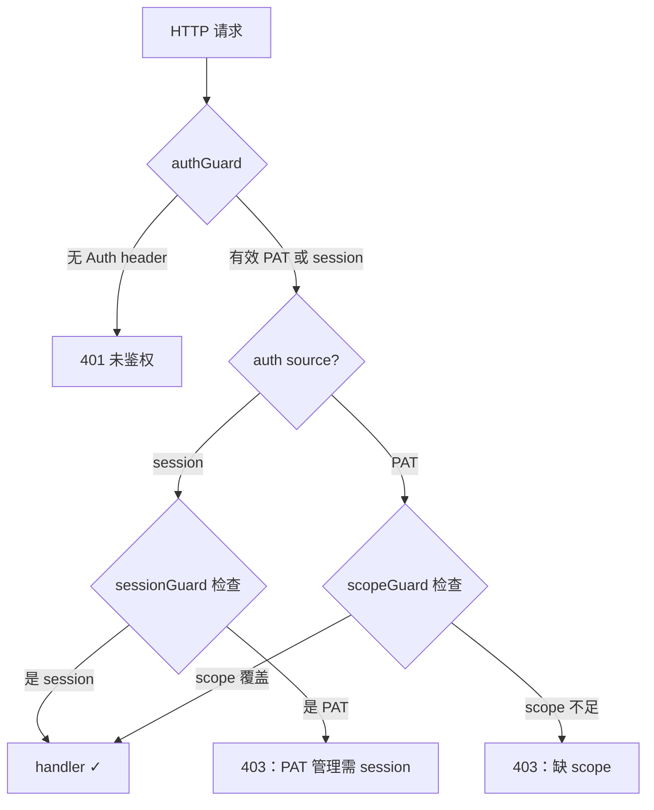

# 鉴权模型

QuantumAtlas 的鉴权回答两个问题：

1. **你是谁？**（authentication）
2. **你能做什么？**（authorization）

这两件事在系统里由不同的层处理。理解清楚能避免很多"我有 token 啊为什么 403"的疑惑。

## 三种身份载体

| 载体 | 谁能拥有 | 寿命 | 怎么获得 | 隐式 scope |
|---|---|---|---|---|
| **PocketBase session** | 浏览器登录用户 | 默认 14 天，自动续期 | GitHub OAuth 登录后，浏览器自动持有（`pb.authStore`，不需要复制） | `*`（全权限）|
| **PAT (Personal Access Token)** | 任何登录用户 | 1–365 天 | 在 `/pat` 页面创建 | 显式 opt-in，**默认空集 = 不能写**|
| **System PAT**（可选，运维兜底）| ops（写 `.env` 的人）| 永不过期，rotation = 改 env+restart | 在 server 的 `.env` 写 `QATLAS_SYSTEM_PAT=<plaintext>` | 默认 `*`，可通过 `QATLAS_SYSTEM_PAT_SCOPES` 限缩 |
| **匿名** | 任何人 | — | 不带 `Authorization` 头 | 仅 health / meta 等无数据端点 |

!!! tip "三种 token 怎么选？"

    - **Session**：浏览器里自动用（基本无感）；**没有 UI 入口让你 copy 它**——非浏览器用例改用下面两种
    - **PAT**：CLI / 人工脚本 / 想钉到具体人身份的 ingest 工具——最常见的"我手里有个写权限 token"
    - **System PAT**：CI / cron / pb_data 出问题时的 breaking glass——env 加载，跟 PocketBase 完全解耦

PAT 明文以 `qat_` 开头，**只在创建时显示一次**，server 只存 bcrypt 哈希。丢了就只能 revoke + 重建。

System PAT 明文格式随意（推荐 `openssl rand -base64 32`），**只活在进程内存 + .env 里**，server 不持久化也不哈希。详见 [§System PAT](#system-pat)。

## 谁能登录（GitHub 白名单）

读口已全锁（见 [§哪些端点要鉴权](#哪些端点要鉴权)）后，"匿名拿 401" 只是第一道墙；第二道墙是 **不是任何 GitHub 账号都能换到 session**。

`internal/auth/oauth.go` 在 `OnRecordAuthWithOAuth2Request` 钩子里做登录白名单校验：拿到 GitHub 身份、但**还没建 `users` 记录、还没发 token** 那一刻，比对 `Config.IsGitHubLoginAllowed(login)`，不在名单一律返回 **403**、不留任何痕迹。

- 名单来源：`QATLAS_ALLOWED_GITHUB_LOGINS`（逗号分隔，大小写不敏感）∪ `QATLAS_ADMIN_GITHUB_LOGINS`。
- **Fail-closed**：两个名单同时为空 ⇒ **谁都登不了**（含你自己）。这是刻意的"默认上锁"——漏配环境变量得到的是"没人能进"，而不是"整个互联网都能进"。
- 这道闸**既挡新注册、也挡"记录已存在但被移出名单"的老用户**（每次登录都校验，纵深防御）。

!!! warning "别把自己锁死：superuser 是逃生通道"
    这个白名单只管 `users` 集合的 **GitHub OAuth 登录**，**不影响 PocketBase superuser**
    （`_superusers` 集合，邮箱+密码登 `/_/`）。误配/漏配把所有人挡在外面时，用 superuser
    进后台、改 `QATLAS_ALLOWED_GITHUB_LOGINS`、重启 server 即可恢复。所以"全拒"不会变成
    永久砖。

## DB 角色：is_admin / is_superadmin / disabled

除了上面的 env 白名单 admin（运维面，`adminGuard`），`users` 记录上还有三个数据库字段
（迁移 `1788100000_add_role_flags_to_users.go`），支撑**用户管理面**：

| 字段 | 谁能改 | 持有者能做什么 |
|---|---|---|
| `is_admin` | superadmin（`PATCH /api/admin/users/{id}`）| 看所有用户 + 切换其他账号可用性；对其他人的 `is_admin` **只读** |
| `is_superadmin` | 仅 bootstrap 播种（`auth.superadmin_logins`）或 `/_/` 后台 | 在 `is_admin` 之上，还能管理其他用户的 `is_admin` |
| `disabled` | admin 及以上 | 账号可用性开关（**注意反向极性**：PB bool 无默认值，零值必须是常态=未禁用）|

接口（均为 `userAdminGuard`：浏览器 session + 上述任一角色；PAT 一律拒绝）：

```
GET   /api/admin/users          # 全量用户列表（含 is_admin/is_superadmin/disabled）
PATCH /api/admin/users/{id}     # body: {"disabled": bool} 或 {"is_admin": bool}（后者需 superadmin）
```

要点：

- **env 白名单 admin 在此面上是 superadmin 等价**——运维永远保有角色管理权，即使所有 DB 标志全灭。
- **`disabled` 的生效是即时的**：`isAuthorized` 每个请求都会复查该标志（session 与 PAT 两条路），OAuth 登录钩子也会拒绝禁用账号换新 session。管理员禁用一个账号后，其 14 天 session 与全部 PAT 立即失效。
- **自我保护**：不能禁用自己、不能改自己的 `is_admin`、admin 不能禁用 superadmin——防止把管理面自己锁死。
- **`is_superadmin` 不可通过 API 授予**（防止一次 admin session 泄漏直接提权）：播种源是配置文件的 `auth.superadmin_logins`（每次启动单调晋升，从不下调）或 `/_/` 后台手改。
- 这三个字段与 env 白名单 admin 的关系：`adminGuard`（db schema / usage / mineru 等运维端点）**仍然只认 env 白名单**，DB 角色不扩权到运维面。

## Scope 词表

PAT 携带一组显式 scope（GitHub fine-grained PAT 同款设计）。当前词表：

| Scope | 覆盖端点 |
|---|---|
| `papers:read` | `POST /api/search` `GET /api/papers/stats` `GET /api/papers/needs-mineru`；当部署方启用 `QATLAS_PAPER_ACCESS_ENABLED` 时还覆盖 `GET /api/papers/{id}/markdown` `GET /api/papers/{id}/markdown/status` |
| `papers:write` | `POST /api/papers/{id}/upload-pdf` `POST /api/papers/{id}/upload-mineru` `POST /api/v1/papers/{id}/mineru-lease` `DELETE /api/v1/papers/{id}/mineru-lease/{cid}`（隐式含 `papers:read`）|
| `plugins:read` | `GET /api/v1/plugins` |
| `plugins:write` | `POST /api/v1/plugins/{id}/enable` `POST /api/v1/plugins/{id}/disable`（隐式含 `plugins:read`）|
| `theorems:read` | `GET /api/theorems/list` `GET /api/theorems/families` `GET /api/theorems/stats` `GET /api/theorems/theorem/{fqn}` `GET /api/theorems/theorem-source/{fqn}` `GET /api/theorems/sync/status` |
| `theorems:write` | `POST /api/theorems/sync/pull`（服务端 git fast-forward + 缓存 reload；隐式含 `theorems:read`）|

**Scope 是编译时静态的**——加新 scope 需要改代码 + 重新部署。完整词表在 `internal/pat/scopes.go`。

!!! warning "PAT 默认空集 = 什么都调不了"
    创建 PAT 时**至少要勾一个 scope**，否则该 PAT 调任何端点（读或写）都是 403。知识库**不再匿名可读**——浏览页面、搜索、查图谱都需要 session token，或带相应 `*:read` scope 的 PAT。仅 health / server-info / 安装脚本 / SPA 外壳 这几个无数据端点保持公开。

## 端点的三种门禁

服务端有三层门禁，写在 `internal/routes/auth.go` 和 `internal/routes/scope_guard.go`：


```mermaid
flowchart TD
    REQ[HTTP 请求] --> AG{authGuard}
    AG -->|无 Auth header| R401[401 未鉴权]
    AG -->|有效 PAT 或 session| ID{auth source?}
    ID -->|session| SG{sessionGuard 检查}
    ID -->|PAT| SCG{scopeGuard 检查}
    SG -->|是 session| H[handler ✓]
    SG -->|是 PAT| R403S[403：PAT 管理需 session]
    SCG -->|scope 覆盖| H
    SCG -->|scope 不足| R403P[403：缺 scope]
```

- **`authGuard`** — 只要有效凭据就放行；少数无数据公开端点（health / server-info / 安装脚本 / SPA）不挂这层。
- **`scopeGuard(obj, act)`** — 在 `authGuard` 之上再检查 PAT 是否包含覆盖 `(obj, act)` 的 scope。**session 自动 bypass**（它有隐式 `*`）。所有读口（`*:read`）和写口（`*:write`）都挂这层。
- **`sessionGuard`** — 比 `authGuard` 更严，**显式拒绝 PAT auth**。只用在 `/api/pat` 自己（PAT 管理只能浏览器做）—— 防止 leaked PAT 自我复制。

## 哪些端点要鉴权

完整清单在 [REST API 参考](../server/rest-api.md)。粗略分布：

| 类别 | 鉴权 |
|---|---|
| 论文搜索 (`POST /api/search`) | `authGuard + papers:read` |
| 论文元数据查询 (`GET /api/papers/{id}/stats`、`GET /api/papers/needs-mineru`) | `authGuard + papers:read` |
| 论文 markdown 下载 (`GET /api/papers/{id}/markdown`、`/markdown/status`) | `authGuard + papers:read`（**仅 `QATLAS_PAPER_ACCESS_ENABLED=true` 时注册**）|
| Health / Meta (`/api/health`、`/api/server/info`、`/api/pat/scopes`、`/install-qatlasd.sh`、`/swagger/*`、SPA `/{path...}`) | **公开**（无数据 / bootstrap / 外壳）|
| 论文上传 / mineru 相关 | `authGuard + papers:write` |
| **PAT 管理** (`/api/pat`) | `sessionGuard`（拒 PAT）|
| **用户管理** (`GET /api/admin/users`、`PATCH /api/admin/users/{id}`) | `userAdminGuard`（session + is_admin / is_superadmin / env 白名单，拒 PAT）|

设计原则：**凡是返回语料数据的端点（读和写）都要鉴权**；只有"无数据"的探活 / 版本 / 安装脚本 / 文档 / SPA 外壳保持公开。知识库不再匿名可读。论文 PDF / Markdown 字节在 quantum-atlas.ai 等公开实例上**默认不通过 HTTP API 对外分发**（`QATLAS_PAPER_ACCESS_ENABLED=false`）——客户端只能查询元数据（OpenAlex 同步进来的内容）与论文具备何种资产的开关位（`stats` / `needs-mineru`）。Self-hosted 部署可在受控范围内打开该开关，启用后 `papers:read` 同时覆盖 `GET /api/papers/{id}/markdown` 类端点，详见 [License & Attribution · 论文访问开关](../about/license-and-attribution.md#论文访问开关-self-hosted)。

## 怎么实操

=== "浏览器用户"

    GitHub OAuth 登录后浏览器自动持有 session token（`pb.authStore`，不需要复制）。SPA 内所有调用自动带 `Authorization: Bearer <session>`，**14 天到期会自动续期**。

    这种 token 隐式拥有全部权限（包括 PAT 管理），但**只在浏览器里有用**——不暴露 UI 入口去手动 copy。需要非浏览器调用走下面的 PAT。

=== "CLI 长期"

    上 `/pat` 创建 PAT，勾上需要的 scope（典型组合：`papers:write` + `theorems:read`），设置 30–365 天到期。

    `qatlas auth login -s quantum-atlas.ai` 会跑 OAuth device-code flow，浏览器里 Approve 后 token 自动写进 `~/.config/qatlas/hosts.yml`。之后所有 `qatlas` 命令自动用这个 PAT。

=== "CI / Agent"

    跟 CLI 长期一样建 PAT，但通过 stdin 注入 hosts.yml 而不是 argv / env：

    ```bash
    # 从 secret 拿到 PAT 后，echo 进 qatlas auth login --with-token（从 stdin 读，不进 history / ps）
    echo "$QATLAS_TOKEN_FROM_SECRET" | qatlas auth login -s quantum-atlas.ai --with-token
    qatlas contrib pdf ...
    ```

    v0.17.0 起 client 不再读 `QATLAS_TOKEN` env、不再支持 `--token` flag——
    都必须经 `qatlas auth login --with-token` 从 stdin 写到 hosts.yml。理由：
    单入口减少认知负担，跟 `gh auth login --with-token` 同款设计；secret
    从 stdin 走也避免被 shell history / `ps` / CI runner log 抓到。

更详细的操作见 [管理凭据](../client/manage-credentials.md)。

## 多边缘节点的坑

QuantumAtlas 可以做多边缘 active-active 部署（多台 edge 各跑独立 qatlasd）。**每台边缘有自己独立的 PocketBase**——意味着：

- 同一 GitHub 账号在多台边缘各登一次 → 各创建一条 users 记录（不同 user_id）
- Edge A 上建的 PAT **不能在 Edge B 用**（401）

CI 多线路场景下需要为每条线路分别建 PAT。

## 反代注入的审计头

可选：反向代理可以注入 `X-Token-Subject`（具体头名由 `QATLAS_USER_HEADER` 决定）作为审计元数据。**这个头不参与鉴权**——只是审计层补充信息，跟 PAT/session 鉴权完全正交。

## System PAT — 运维专用 breaking-glass token { #system-pat }

```bash
# .env / systemd Environment=
QATLAS_SYSTEM_PAT=<你自己生成的强随机串，≥16 字符>
QATLAS_SYSTEM_PAT_SCOPES=*    # 可选，默认 *
```

未设 / 留空 = 功能完全关闭（默认状态）。设了以后：

- 任何 HTTP 请求带 `Authorization: Bearer <这串>` 就过 authGuard
- 永远不查 PocketBase，永远不绑 user record
- 启动日志一行 `system PAT enabled (length=N scopes=[...])` 确认生效（**不打明文**）
- 启动时硬校验长度 ≥16，太短直接 fatal exit 防 placeholder 上 prod
- 命中时审计来源标 `system-pat`（user PAT 是 `pat`，session 是 `session`），日志能分清

### 跟 user PAT 的区别

| 维度 | User PAT (`qat_...`) | System PAT |
|---|---|---|
| 存哪 | pb_data SQLite (`pat_tokens` 表，bcrypt) | 进程内存（只在 `QATLAS_SYSTEM_PAT` env） |
| 怎么创建 | 浏览器 OAuth 登录后到 `/pat` | 运维直接挑随机串写进 .env / Environment= |
| 寿命 | 1–365 天，强制过期 | 无过期；rotation = 改 env + restart |
| 数量 | 每个 user 可建多个 | **全局只有一个** |
| 默认 scope | 空集 = 不能写 | `*` (master)；可在 env 里覆盖 |
| 能不能用 `*` | ❌ `pat mint` 拒绝 | ✅ 是默认值 |
| 能不能调 `/api/pat` 管 user PAT | ❌ sessionGuard 拒绝 | ❌ 同样被 sessionGuard 拒绝（防 leaked token 自我复制） |
| pb_data 不在时还能用 | ❌ | ✅ 这是设计目的 |

### 适用场景

- 新 edge bootstrap：还没人 OAuth 登过，但 sync / 灌数据已经要跑
- 灾难恢复：pb_data 损坏 / 被清空，要 API 重建
- CI / cron：长跑脚本，不想跟某个具体人绑定 + 不想被 365 天过期打扰
- 临时调试 / 一次性 ops 脚本

### 安全边界

能读到 `QATLAS_SYSTEM_PAT` 的人 = superuser-equivalent。但这跟 `.env` 里早就有的 `QATLAS_S3_SECRET_ACCESS_KEY` / `QATLAS_POSTGRES_DSN` / `GITHUB_CLIENT_SECRET` 同等敏感——读到 .env 的人本来就能干很多事。新增 system PAT **不扩大现有 .env 的攻击面**。

要求 .env 文件 mode 600 + 服务用户 owner，跟现有约定一致。**不要**把 plaintext 贴进 git / commit / issue / chat 等任何持久化位置。
