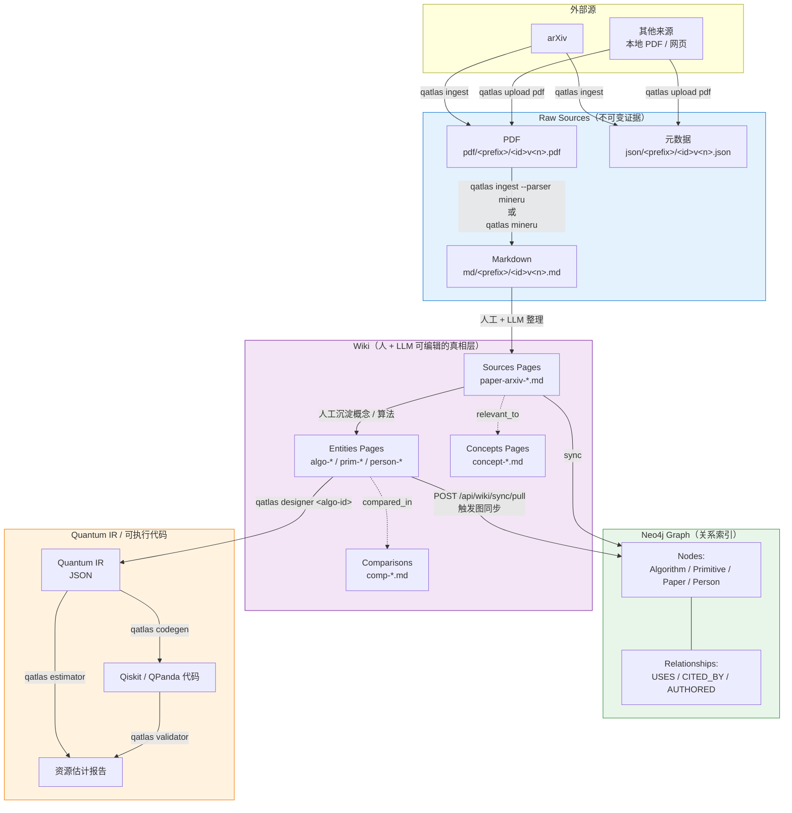
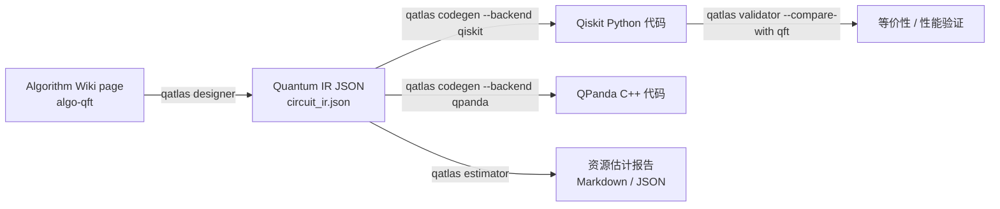

# 数据流：论文从 arXiv 到可执行代码

这张图是 QuantumAtlas 端到端的「主线剧情」。每个箭头都对应一个真实的 CLI 命令或 server 操作。



## 三种贡献路径

数据可以从三个地方进入 Raw 层。**最终落地路径都一样**（`<raw>/pdf/<YYMM>/<id>v<n>.pdf` 等），区别只是触发者：

=== "1. 服务器自动抓取"

    ```bash
    qatlas ingest quant-ph/9508027 --parser mineru
    ```

    server 调 arXiv API 抓 PDF + metadata，可选立刻调 MinerU 解析。**触发方需要 `papers:write` scope**。

=== "2. 用户直接上传"

    ```bash
    qatlas upload pdf 2501.00010v1 --pdf paper.pdf
    qatlas upload mineru 2501.00010v1 --zip mineru-result.zip --source mineru
    ```

    适合：手里已经有 PDF（公司内部论文、扫描件、preprint 私下流传版本）、或在别处跑过 MinerU 留下了完整结果 zip。**需要 `papers:write` scope**。

=== "3. 用户本地跑 MinerU 推回"

    ```bash
    # 配 MINERU_API_TOKENS 后
    qatlas mineru 2501.00010v1 --push-pdf
    # 或队列模式，处理 server 列表里所有待解析的
    qatlas mineru --batch-size 20
    ```

    本地用自己的 MinerU 配额跑解析。**server 颁发 30 分钟原子 claim**——多个贡献者并发跑不会撞重。需要 `papers:write` scope。

详见 [上传论文资产](../guides/upload-assets.md) 和 [用 MinerU 解析](../guides/parse-with-mineru.md)。

## Wiki 沉淀的两种方式

从 Raw Markdown 到 Wiki 页面没有完全自动化的路径——**有意如此**。Wiki 是人 + LLM 共同审阅后的结果，不是直接拼接。

- **人写**：研究者读完 raw markdown，提炼出 algorithm / primitive / paper 三类页面。模板见 [写 Wiki 页面](../guides/write-wiki-pages.md)。
- **LLM 辅助**：通过 `qatlas extractor` 抽取候选算法描述（实验性），人 review 后编辑入 Wiki repo。

Wiki 是**独立的 Git 仓库**（[QuantumAtlas-Wiki](https://github.com/IAI-USTC-Quantum/QuantumAtlas-Wiki)），任何人 clone / commit / PR 都可以。Server 端的 wiki checkout **只接受 fast-forward pull**（`POST /api/wiki/sync/pull`），无需 SSH 上服务器。

## Wiki → Neo4j 同步 { #wiki-neo4j }

只有 **Entities** 和 **Sources** 类型的页面会同步到 Neo4j：

| Wiki 页面类型 | Neo4j 节点 | 同步 |
|---|---|---|
| Concepts | (不同步) | 仅用作 Wiki 内交叉引用 |
| Entities / Algorithms | `:Algorithm` | ✅ |
| Entities / Primitives | `:Primitive` | ✅ |
| Entities / People | `:Person` | ✅ |
| Sources / Papers | `:Paper` | ✅ |
| Comparisons | (不同步) | 仅用作阅读视图 |

YAML frontmatter 里的 `related: [...]` 和正文里的 `[[page-id]]` 都会变成 Neo4j 关系。完整 schema 在 [Wiki schema 参考](../reference/wiki-schema.md)。

## 从算法到代码



每一步都可以独立运行 / 替换 / 缓存。`circuit_ir.json` 是 Quantum IR 的载体，是后续步骤的统一输入。详见 [电路工具链](../guides/circuit-toolchain.md)。

## 关键不变量

!!! abstract "记住这几条"

    - **Raw 是证据**，几乎不改，可追溯；
    - **Wiki 是真相**，可审阅、可编辑、有 lint；
    - **Neo4j 是索引**，可重建、不可信赖唯一性（一切冲突以 Wiki 为准）；
    - **代码是产物**，可再生、不存进库（除非你 `qatlas codegen -o foo.py` 保存）。

理解这四条就能理解 90% 的设计决定。
