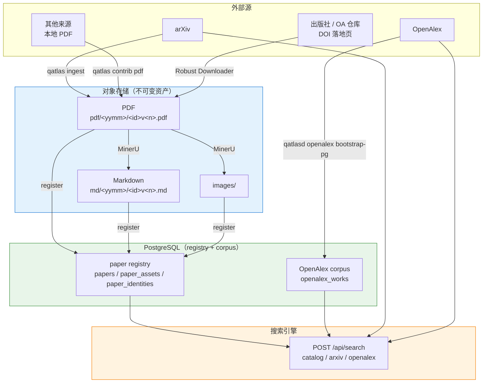

# 数据流：论文从 arXiv 到可检索资产

这张图是 QuantumAtlas 端到端的「主线剧情」。每个箭头都对应一个真实的 CLI 命令或 server 操作。


```mermaid
flowchart TB
    subgraph SRC ["外部源"]
        ARX[arXiv]
        OTH[其他来源<br/>本地 PDF]
        OA[OpenAlex]
        PUB[出版社 / OA 仓库<br/>DOI 落地页]
    end

    subgraph STORE ["对象存储（不可变资产）"]
        PDF[PDF<br/>pdf/&lt;yymm&gt;/&lt;id&gt;v&lt;n&gt;.pdf]
        MD[Markdown<br/>md/&lt;yymm&gt;/&lt;id&gt;v&lt;n&gt;.md]
        IMG[images/]
    end

    subgraph PG ["PostgreSQL（registry + corpus）"]
        REG[paper registry<br/>papers / paper_assets / paper_identities]
        CORP[OpenAlex corpus<br/>openalex_works]
    end

    subgraph SEARCH ["搜索引擎"]
        ENG[POST /api/search<br/>catalog / arxiv / openalex]
    end

    ARX -->|qatlas ingest| PDF
    OTH -->|qatlas contrib pdf| PDF
    PUB -->|Robust Downloader| PDF
    PDF -->|MinerU| MD
    PDF -->|MinerU| IMG

    PDF & MD & IMG -->|register| REG
    OA -->|qatlasd openalex bootstrap-pg| CORP

    REG & CORP --> ENG
    ARX & OA --> ENG

    style STORE fill:#e3f2fd,stroke:#1976d2
    style PG fill:#e8f5e9,stroke:#388e3c
    style SEARCH fill:#fff3e0,stroke:#f57c00
```

## 四种获取路径

数据可以从四个地方进入资产层。**最终的保存路径都一样**（`<raw>/pdf/<YYMM>/<id>v<n>.pdf` 等，S3 后端时是对应 bucket 里的对象 key），区别只是触发者：

=== "1. 服务器自动抓取（arXiv）"

    ```bash
    qatlas ingest quant-ph/9508027 --parser mineru
    ```

    server 调 arXiv API 抓 PDF + metadata，可选立刻调 MinerU 解析。**触发方需要 `papers:write` scope**。

=== "2. 用户直接上传"

    ```bash
    qatlas contrib pdf 2501.00010v1 --pdf paper.pdf
    ```

    适合：手里已经有 PDF（公司内部论文、扫描件、preprint 私下流传版本）。**需要 `papers:write` scope**。

=== "3. 用户本地跑 MinerU 推回"

    ```bash
    # 配 mineru_api_tokens 后
    qatlas contrib mineru 2501.00010v1 --push-pdf
    # 或队列模式，处理 server 列表里所有待解析的
    qatlas contrib mineru --batch-size 20
    ```

    本地用自己的 MinerU 配额跑解析。**server 颁发 30 分钟原子 claim**——多个贡献者并发跑不会撞重。需要 `papers:write` scope。

=== "4. Robust Downloader（DOI / 正式版批量抓取）"

    ```http
    POST /api/downloader/fetch
    {"items": ["10.1038/s41586-024-07806-9", "arXiv:2401.12345"]}
    ```

    给 DOI / arXiv id / 论文 URL（单批 ≤50 条），server 跑多范式策略阶梯
    （arXiv 直下 → OpenAlex twin → OA 元数据 API → 出版社 URL 模板 → 落地页
    挖掘 → 浏览器 lane / LLM 兜底 / 远端代理）抓**正式版 PDF**，统一验证后
    入库并驱动 MinerU。SPA 页面 `/$lang/downloader`。与前两条路径的区别：
    **来源不限于 arXiv**——绿色 OA 仓库、出版社模式 URL、需要 entitlement 的
    落地页都在射程内。需要 `papers:write`（提交）/ `papers:read`（查 job）scope。

详见 [上传论文资产](../client/upload-assets.md)、[用 MinerU 解析](../client/parse-with-mineru.md) 和 [Robust Downloader](../server/downloader.md)。

## 懒加载摄入（lazy ingest）

`GET /api/papers/{id_or_doi}/markdown`（仅当部署方开启
`QATLAS_PAPER_ACCESS_ENABLED`；PDF 分发已停用——`/pdf` 恒 410，PDF 抓取只是
markdown 管线的内部阶段）在缓存未命中时**不阻塞**：server 立即返回
202 + `Operation-Location`，后台静默从 arxiv.org fetch PDF 并串 MinerU 转换，
客户端轮询 `/markdown/status` 直到 `state == cached` 再 GET 拿字节。同一篇
论文的 N 个并发请求被 server-side dedupe 成 1 次 fetch + 1 次 convert。完整协议见
[REST API · 长任务](../server/rest-api.md)。

## Registry 写入路径

```text
1. PUT s3://qatlas-pdf/<yymm>/<stem>.pdf        ← 字节先落对象存储
2. INSERT ... ON CONFLICT papers + paper_assets ← PostgreSQL registry 同步
3. PostgreSQL 不可用时：HTTP 仍成功 + X-Catalog-Sync: deferred
4. 之后跑 qatlasd papers sync --full --from-rustfs 从对象存储重建缺失状态
```

对象存储是资产字节的 source of truth；PostgreSQL 是可重建的集合索引与租约层。

## 搜索路径

`POST /api/search` 接收一个 SearchEntry JSON，engine 按 config.yaml 的
`search.providers`（默认 `catalog,arxiv,openalex`）fan-out：

- **catalog**：本地 PostgreSQL registry 的元数据 + 资产状态；
- **arxiv / openalex**：上游在线查询（建议配 `paper_access.openalex_mailto` 进 polite pool）。

`search.remote` 启用后另有 `POST /api/search/multi`：逐平台（backend）返回
**原始**命中列表，不做跨源融合——SPA 的 backend picker + 每平台 Tab 渲染
就是这条路径（见 [REST API · Search](../server/rest-api.md)）。

语义向量检索不在 `/api/search` 的 provider 列表里：它由独立的 qatlas-rag
微服务提供（dense+sparse 混合检索，RRF + rerank），经 qatlas-search 作为
fan-out 的一个 backend 接入；qatlasd 在论文 ready 时向 qatlas-rag 推送
索引（config.yaml 的 `rag.remote` 段）。

## 关键不变量

!!! abstract "记住这几条"

    - **对象存储是证据**，几乎不改，可追溯；
    - **PostgreSQL 是 registry**，可重建、可 SQL 查询；冲突时以对象存储为准；
    - **搜索是派生视图**，provider 可增删，不持有独立事实。

理解这三条就能理解 90% 的设计决定。
