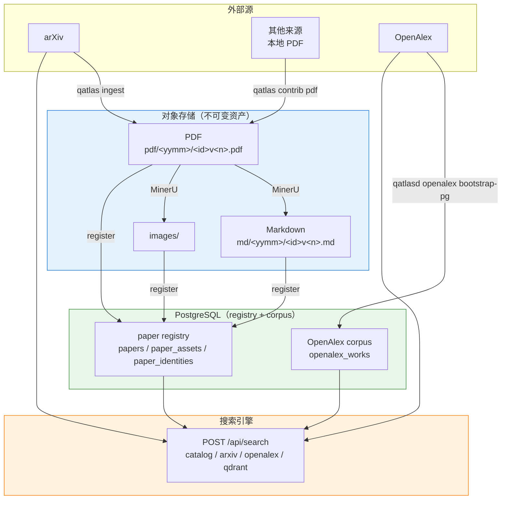

# 数据流：论文从 arXiv 到可检索资产

这张图是 QuantumAtlas 端到端的「主线剧情」。每个箭头都对应一个真实的 CLI 命令或 server 操作。


```mermaid
flowchart TB
    subgraph SRC ["外部源"]
        ARX[arXiv]
        OTH[其他来源<br/>本地 PDF]
        OA[OpenAlex]
    end

    subgraph STORE ["对象存储（不可变资产）"]
        PDF[PDF<br/>pdf/&lt;yymm&gt;/&lt;id&gt;v&lt;n&gt;.pdf]
        MD[Markdown<br/>md/&lt;yymm&gt;/&lt;id&gt;v&lt;n&gt;.md]
        IMG[images/]
    end

    subgraph PG ["PostgreSQL（registry + corpus）"]
        REG[paper registry<br/>papers / paper_assets / paper_identities]
        CORP[OpenAlex corpus<br/>openalex_works]
    end

    subgraph SEARCH ["搜索引擎"]
        ENG[POST /api/search<br/>catalog / arxiv / openalex / qdrant]
    end

    ARX -->|qatlas ingest| PDF
    OTH -->|qatlas contrib pdf| PDF
    PDF -->|MinerU| MD
    PDF -->|MinerU| IMG

    PDF & MD & IMG -->|register| REG
    OA -->|qatlasd openalex bootstrap-pg| CORP

    REG & CORP --> ENG
    ARX & OA --> ENG

    style STORE fill:#e3f2fd,stroke:#1976d2
    style PG fill:#e8f5e9,stroke:#388e3c
    style SEARCH fill:#fff3e0,stroke:#f57c00
```

## 三种贡献路径

数据可以从三个地方进入资产层。**最终落地路径都一样**（`<raw>/pdf/<YYMM>/<id>v<n>.pdf` 等，S3 后端时是对应 bucket 里的对象 key），区别只是触发者：

=== "1. 服务器自动抓取"

    ```bash
    qatlas ingest quant-ph/9508027 --parser mineru
    ```

    server 调 arXiv API 抓 PDF + metadata，可选立刻调 MinerU 解析。**触发方需要 `papers:write` scope**。

=== "2. 用户直接上传"

    ```bash
    qatlas contrib pdf 2501.00010v1 --pdf paper.pdf
    ```

    适合：手里已经有 PDF（公司内部论文、扫描件、preprint 私下流传版本）。**需要 `papers:write` scope**。

=== "3. 用户本地跑 MinerU 推回"

    ```bash
    # 配 mineru_api_tokens 后
    qatlas contrib mineru 2501.00010v1 --push-pdf
    # 或队列模式，处理 server 列表里所有待解析的
    qatlas contrib mineru --batch-size 20
    ```

    本地用自己的 MinerU 配额跑解析。**server 颁发 30 分钟原子 claim**——多个贡献者并发跑不会撞重。需要 `papers:write` scope。

详见 [上传论文资产](../client/upload-assets.md) 和 [用 MinerU 解析](../client/parse-with-mineru.md)。

## 懒加载摄入（lazy ingest）

`GET /api/papers/{id_or_doi}/markdown` / `/pdf`（仅当部署方开启
`QATLAS_PAPER_ACCESS_ENABLED`）在缓存未命中时**不阻塞**：server 立即返回
202 + `Operation-Location`，后台静默从 arxiv.org fetch PDF（markdown 路径还会
串 MinerU 转换），客户端轮询 `/markdown/status` / `/pdf/status` 直到
`state == cached` 再 GET 拿字节。同一篇论文的 N 个并发请求被 server-side
dedupe 成 1 次 fetch + 1 次 convert。完整协议见
[REST API · 长任务](../server/rest-api.md)。

## Registry 写入路径

```text
1. PUT s3://qatlas-pdf/<yymm>/<stem>.pdf        ← 字节先落对象存储
2. INSERT ... ON CONFLICT papers + paper_assets ← PostgreSQL registry 同步
3. PostgreSQL 不可用时：HTTP 仍成功 + X-Catalog-Sync: deferred
4. 之后跑 qatlasd papers sync --full --from-rustfs 从对象存储重建缺失状态
```

对象存储是资产字节的 source of truth；PostgreSQL 是可重建的集合索引与租约层。

## 搜索路径

`POST /api/search` 接收一个 SearchEntry JSON，engine 按
`QATLAS_SEARCH_PROVIDERS`（默认 `catalog,arxiv,openalex`）fan-out：

- **catalog**：本地 PostgreSQL registry 的元数据 + 资产状态；
- **arxiv / openalex**：上游在线查询（建议配 `QATLAS_OPENALEX_MAILTO` 进 polite pool）；
- **qdrant**（可选）：配齐 `QATLAS_RAG_QDRANT_URL` + `QATLAS_RAG_EMBED_URL` 后，
  qatlasd 直接 gRPC 查 Qdrant 混合向量检索（dense+sparse, RRF + rerank）。

## 关键不变量

!!! abstract "记住这几条"

    - **对象存储是证据**，几乎不改，可追溯；
    - **PostgreSQL 是 registry**，可重建、可 SQL 查询；冲突时以对象存储为准；
    - **搜索是派生视图**，provider 可增删，不持有独立事实。

理解这三条就能理解 90% 的设计决定。
