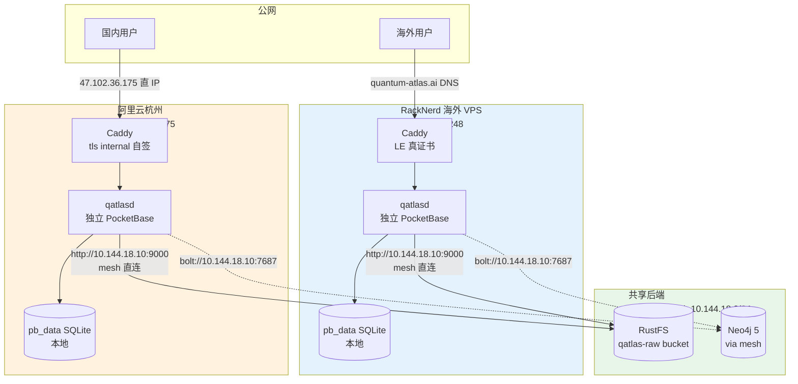

# 多边缘部署

QuantumAtlas 的生产部署是**多边缘 active-active**：海外 + 国内各跑一份独立的 server，共享 RustFS 对象存储和（可选）Neo4j。

## 现状架构



## 共享什么、不共享什么

| 资源 | 共享？ | 说明 |
|---|---|---|
| RustFS（PDF / Markdown / metadata）| ✅ | 同一 bucket，同一 svcacct，跨边缘上传不冲突 |
| Neo4j 图数据库 | ✅ | 跨 EasyTier mesh 同一实例 |
| Wiki Git checkout | ❌（各自一份）| 每台边缘各自 `git clone`，独立 fast-forward pull |
| PocketBase `pb_data` SQLite | ❌（各自一份）| 用户表 / PAT / share record 都不跨节点同步 |
| GitHub OAuth App | ❌（各自一个）| GitHub 限制每个 App 单 callback URL，所以每台边缘对应一个 OAuth app |

## 用户视角的两种入口

| 入口 | URL | TLS | 适用 |
|---|---|---|---|
| **RackNerd（默认）** | `https://quantum-atlas.ai` | Let's Encrypt 真证书 | 海外用户、默认 DNS |
| **阿里云（国内线路）** | `https://47.102.36.175` + `QATLAS_INSECURE=1` | Caddy `tls internal`（IP SAN，自签）| 国内用户、RackNerd 卡时备用 |

阿里云**未备案**所以不能挂任意域名走 443，只能直 IP + 自签证书。client 必须接受自签（`--insecure` 或 `QATLAS_INSECURE=1`）。

## 用户身份 / PAT 的影响

因为 PocketBase 各自独立：

- 同一 GitHub 账号在 RackNerd 登 → 建一条 users 记录（user_id_A）
- 同一账号在阿里云登 → 建另一条 users 记录（user_id_B）
- 两边各自管理自己的 PAT、share、settings

**实操要点**：

=== "切换线路"

    日常如果只用 RackNerd，无需关心。**国内 CI 双线路**才需要分别拿 PAT：

    ```bash
    qatlas auth login -H quantum-atlas.ai          # RackNerd PAT
    qatlas auth login -H 47.102.36.175             # 阿里云 PAT

    # 同一台机跑两条线路
    qatlas upload pdf ... -H quantum-atlas.ai
    qatlas upload pdf ... -H 47.102.36.175 --insecure
    ```

=== "CI 多线路"

    GitHub Actions 给两条线路准备两个 secret：

    ```yaml
    env:
      QATLAS_TOKEN_RACKNERD: ${{ secrets.QATLAS_TOKEN_RACKNERD }}
      QATLAS_TOKEN_ALIBABA: ${{ secrets.QATLAS_TOKEN_ALIBABA }}
    ```

    然后跑命令时按目标切换：

    ```bash
    QATLAS_SERVER_URL=https://quantum-atlas.ai \
    QATLAS_TOKEN=$QATLAS_TOKEN_RACKNERD \
        qatlas upload pdf ...

    QATLAS_SERVER_URL=https://47.102.36.175 \
    QATLAS_TOKEN=$QATLAS_TOKEN_ALIBABA \
    QATLAS_INSECURE=1 \
        qatlas upload pdf ...
    ```

## Presign URL：为什么 share URL 跟 server URL 同源

`/api/shares/` 创建后返回的 URL 形如 `https://raw.quantum-atlas.ai/qatlas-raw/...`（RackNerd）或 `https://47.102.36.175:9000/qatlas-raw/...`（阿里云）。每台边缘**用自己的 `QATLAS_S3_PUBLIC_ENDPOINT` 签 URL**，所以 client 拿到的 share 链接会沿原线路回到本边缘的 RustFS 公网入口，不会跨边缘绕路。

底层 server↔RustFS 通讯走 mesh 直连 `http://10.144.18.10:9000`（省一跳反代 + TLS 终结），只有给 client 的 presigned URL 才用公网 host。详见 [RustFS 部署](../deployment/rustfs.md#dual-endpoint)。

## 边缘崩了怎么办

active-active 的好处是单边缘挂了另一边照常工作。DNS 没有自动 failover，但 client 可以临时切：

```bash
# RackNerd 不通时手动改用阿里云
qatlas auth status                          # 看哪些 host 有 token
QATLAS_SERVER_URL=https://47.102.36.175 \
QATLAS_INSECURE=1 qatlas wiki search "..."
```

恢复后切回 `quantum-atlas.ai` 即可。**底层数据**（RustFS bucket / Neo4j / Wiki Git）始终一致，切回完全无缝。
