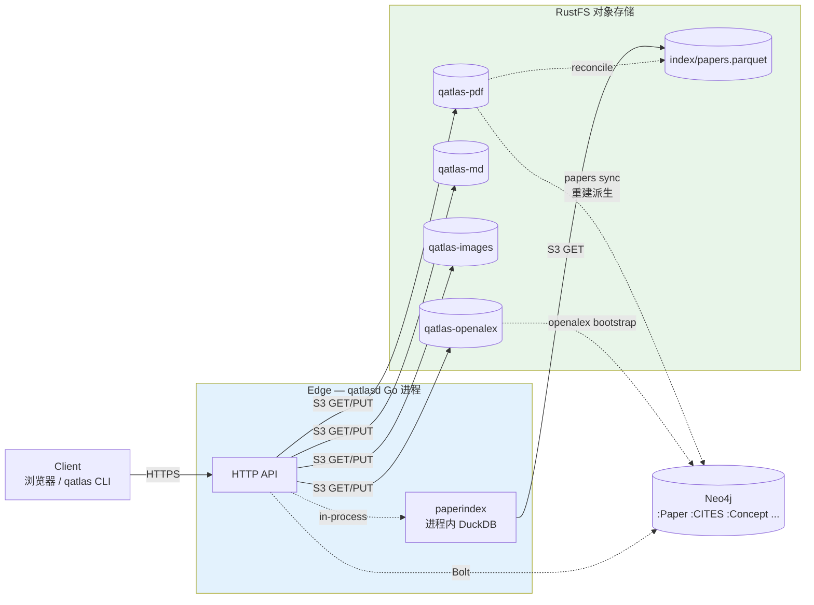

# 存储架构

> **范围**：QuantumAtlas 处理大体量论文时三层存储引擎（对象存储 + 索引 + 图）的职责
> 边界、数据流与对账规则。本文给"为什么不把 PDF 塞 Neo4j 节点属性"、"图脏了怎么重建"、
> "桶之间漏对象怎么核"这类反复出现的问题一个 canonical 回答。
>
> **不在范围**：具体安装步骤 / 容器配置 / bootstrap 脚本走 [`deployment/`](../deployment/index.md)；
> 项目整体应用分层走 [`architecture.md`](architecture.md)；多边缘节点拓扑走内部仓库的
> 部署文档。

## 1. 为什么分三层引擎

QuantumAtlas 处理论文图谱的本质问题是：

- **PDF 是 MB 级 blob**，存量 TB 级，IO 模式是"偶尔整文件下载"。
- **元数据要按字段筛**（"有 PDF 但没 markdown 的"、"上周处理过的"、"category=quant-ph"）。
- **引用关系是图**，访问模式是 K 跳遍历和图算法（PageRank / Louvain），跟前两者完全不同。

强行让一个引擎全包是反模式。**用合适的引擎做合适的事**，三层各管各的，通过稳定标识符串起来：

| 层 | 引擎 | 存什么 | 数据量级 | 访问模式 | source of truth |
|---|---|---|---|---|---|
| Raw blobs | **RustFS**（S3 兼容） | PDF / Markdown / 图片 / OpenAlex snapshot | TB | 偶尔整文件下载 | ✅ 原文不可变 |
| Metadata 索引 | **paperindex**（Parquet + 进程内 DuckDB，**就放在 RustFS 同一个桶里**） | 一个 Parquet 文件 × 数十列 | 134k 行 ≈ 7 MB | 字段筛选 / count / group by | ❌ 可从 bucket LIST 重建 |
| Graph | **Neo4j 5.26 LTS Community** | `(Paper)-[:CITES]->(Paper)` + Wiki 知识图 | 几十 GB | K 跳遍历、图算法 | ❌ 可重建的派生视图 |

**这三层不竞争，互补**。Raw 量翻 10×，Neo4j 完全不动；Neo4j 脏了，从 raw + Wiki 跑
`papers sync` / `wiki sync` 重建；paperindex 漂移，从 bucket LIST 对账。

??? note "paperindex 这层为什么不是一个独立数据库（PostgreSQL / SQLite）"
    paperindex 不开独立数据库，走 **lakehouse-lite 模式**——索引存在 RustFS 桶里
    （`index/papers.parquet`），qatlasd 进程内嵌 DuckDB 直接查 Parquet。

    不再开独立数据库的理由：

    1. **多一个 stateful 系统**：要 backup、要 HA、要 schema migration、跨 edge 节点要复制；
    2. **同步漂移**：DB 和 bucket 在两次写之间的任何 crash 都让两边状态分裂；
    3. **跨 edge 不友好**：两台 edge 各自一份 SQLite 就是漂移源；
    4. **凭据复用**：DuckDB 用同一组 `QATLAS_S3_*` svcacct 直读 Parquet，不开新 secret。

    完整原理 + 跟 Iceberg / Delta Lake 关系见 [`architecture.md` § paperindex 节](architecture.md#paperindex)。

??? note "PocketBase 还在做什么"
    PocketBase（v0.38，嵌入 qatlasd 二进制，SQLite 底）现在只承担 **用户 / PAT** 等本机
    session 状态。每台 edge 一份独立 SQLite，**用户表不跨 edge 同步**（是有意的——
    多边缘 active-active 设计上接受这个 trade-off，详见内部仓库的多边缘部署文档）。

    Paper 元数据由 paperindex 承担，引用图由 Neo4j 承担，PocketBase 不再是 paper 数据源。

## 2. 三层是怎么串起来的



**arxiv ID 作为稳定标识符**（不 content-addressed）：

- 对象 key 形如 `<yymm>/<stem>.<ext>`（如 `2401/2401.00001.pdf`），arxiv-id 寻址
- `sha256` 进 object metadata (`x-amz-meta-sha256`) 做 **content-aware idempotency**：
    - 同 arxiv_id 重传相同字节 → 短路 `200 unchanged`，**不重写 S3**
    - 不同字节 → `409` with both hashes，旧对象不动
    - `--overwrite` 才覆盖（旧版本由 bucket versioning 自动保留）
- 多 client 并发用 S3 **conditional PUT** (`If-None-Match: "*"`) 保证 race-safe（不会
  silent last-writer-wins）
- client 上传时 `?expected_sha256=` 做 in-transit 损坏防护（PyPI / Docker 同款）

完整 upload 写口语义、conditional PUT 实现细节走 [`reference/upload-api.md`](../reference/upload-api.md)。

??? note "为什么是 arxiv ID 而不是 content-addressed（sha256 寻址）"
    content-addressed 命名（`raw/<sha[:2]>/<sha>.pdf`，按 SHA256 寻址）的诱惑是：天然
    dedup、ETag = sha256 对账简单、永远 immutable 下游 cache 可永久缓存、备份只需 rsync
    一个目录树。但这里用 arxiv ID 寻址，理由：

    - arxiv 是天然唯一 ID（不可改、不会撞），按 arxiv 寻址比 SHA 寻址更直观（运维肉眼看 key
      能猜出是哪篇 paper）；
    - 字节级 dedup 在 paper 场景效益低——同一篇 arxiv ID 多版本会改 PDF（v1/v2/v3 不同字节），
      dedup 主要意义不大；
    - content-addressed 要求**任意操作前先算 SHA**，多一次 IO，pipeline 复杂度上升；
    - 真要去重只在 upload 路径加 `x-amz-meta-sha256` metadata + 重传同字节短路即可（v0.7.0
      已实现），桶布局保持 path-addressed。

    跨 arxiv 字节级重复极罕见（预期 < 1%），不值得为它引入 alias DB 做 `arxiv_id → sha256`
    双重 lookup。如未来发现高频跨 arxiv 重复，再切到真正 content-addressed 存储。

## 3. RustFS 桶布局

### 5 + 1 桶速查

| 桶 | 内容 | key 模板 | 大小 | 访问模式 | 公开 / 私有 |
|---|---|---|---|---|---|
| `qatlas-pdf` | 论文 PDF blob | `<yymm>/<stem>.pdf` | MB / 个 | 仅 server / 贡献者上传通道 | 🔒 字节**永不外发**（无下载 API） |
| `qatlas-md` | MinerU 转换的 markdown | `<yymm>/<stem>.md` | KB / 个 | 仅内部读取 / 贡献者上传 | 🔒 字节**永不外发** |
| `qatlas-images` | markdown 内联图（一个 paper 一个子目录）| `<yymm>/<stem>/<file>` | KB ~ 100KB / 张 | 仅内部读取 | 🔒 字节**永不外发** |
| `qatlas-openalex` | OpenAlex 字节级 snapshot mirror | `data/<entity>/<part>.gz` | GB / part，TB / 桶 | 离线 bootstrap / 定期增量 | 🔒 仅内部使用 |
| `qatlas-raw` | **历史单桶**（v0.6.x 时代），冻结只读做 cold backup | `pdf/<yymm>/...` 等 | TB | 备查 | 🔒 不再写 |
| `qatlas-s3-events` | RustFS notify webhook 落盘的 PUT/DELETE 事件流（NDJSON.snappy） | Fluent Bit 自管 | KB ~ MB / 文件 | 审计 / 离线分析 | 🔒 **无 Delete 权限**（write-once 审计） |

paperindex 用的 `index/papers.parquet` 不算独立桶——它就放在某个资产桶下的 `index/` prefix
里（具体哪个桶由 deployment 决定），靠的是同一组 svcacct 凭据。

### 命名约定

**`<yymm>` shard**：所有论文资产按 arxiv ID 前 4 位 `<yymm>`（YearMonth）分片。

- `2401.00001` → `<yymm>` = `2401`
- 老格式 `quant-ph/9508027` → `<yymm>` = `9508`（含 80s/90s 历史论文）

每月 quant-ph 通常几百到几千对象（月均 ~500 篇），listing / 迁移 / 对账按 yymm 切批友好——
单次 list 在 RustFS HDD 上可控。

**`<stem>` arxiv ID**：path-safe arxiv ID 字符串。

- 新格式 → `2401.00001` 直接当 stem
- 老格式 → `quant-ph_9508027`（`/` 换 `_`，跨文件系统安全）

一篇 paper 在三桶里的 key 是**对齐的**：

```
qatlas-pdf/2401/2401.00001.pdf
qatlas-md/2401/2401.00001.md
qatlas-images/2401/2401.00001/fig1.png
qatlas-images/2401/2401.00001/fig2.jpg
```

按 stem 索引就能一次找到一篇 paper 的所有资产。

### Router 抽象（应用层 kind → 桶名翻译）

应用层不直接知道桶名——`internal/objstore.Router` 按 key 的首段 "kind" 分桶：

| 应用层 key | 实际桶 |
|---|---|
| `pdf/2401/2401.00001.pdf` | `qatlas-pdf/2401/2401.00001.pdf` |
| `markdown/2401/2401.00001.md` | `qatlas-md/2401/2401.00001.md` |
| `images/2401/2401.00001/fig1.png` | `qatlas-images/2401/2401.00001/fig1.png` |

> ⚠️ **应用层 kind 名是 `markdown`，但桶名是 `qatlas-md`**——不要在 mc / mirror 脚本里用
> `markdown` 当桶名找不到。Router 这层翻译只在 Go 进程内做。

环境变量（每桶独立配，all-or-nothing 切换）：

- `QATLAS_S3_BUCKET_PDF` → 通常 `qatlas-pdf`
- `QATLAS_S3_BUCKET_MD` → 通常 `qatlas-md`
- `QATLAS_S3_BUCKET_IMAGES` → 通常 `qatlas-images`
- `QATLAS_S3_BUCKET_OPENALEX_SNAPSHOT` → `qatlas-openalex`

启动时如果检测到老的单桶 `QATLAS_S3_BUCKET` 还在 `.env` 里，server **fail loud** 拒绝启动，
要求改成多桶（防止 stale `.env` 把所有对象 silently 灌进一个桶）。

### ACL 与外发策略

| 桶 | 公网直读 | 字节外发 API | 字节是否离开后端 |
|---|---|---|---|
| `qatlas-pdf` | ❌ | ❌（无 download endpoint） | ❌ |
| `qatlas-md` | ❌ | ❌（无 download endpoint） | ❌ |
| `qatlas-images` | ❌ | ❌（无 download endpoint） | ❌ |
| `qatlas-openalex` | ❌ | ❌（仅内部 bootstrap / 增量 sync 用） | ❌ |
| `qatlas-raw` | ❌（历史，已停写） | — | — |

> **资产桶字节永不通过 API 外发**——这是**版权红线**：arxiv PDF 字节版权归原作者，
> QuantumAtlas 只做 metadata + 引用图谱。v0.9.0 起公开 server 删除了所有 PDF / markdown
> 字节级 download endpoint；终端用户想拿 PDF 自己去 [arxiv.org](https://arxiv.org/) 拉。
> 详见 [`license-and-attribution.md`](../about/license-and-attribution.md)。

### 桶生命周期约束

资产桶之间的应用层约束（v0.7.0+ 必须满足）：

- `qatlas-pdf` 是 **truth-of-record** —— `papers sync` 据其 list 重建 Neo4j `:PaperWork.has_pdf` flag
- `qatlas-md` ⊆ `qatlas-pdf`（先有 PDF 才会跑 MinerU 出 md，反之不成立——有些 PDF 还没跑 MinerU）
- `qatlas-images` ⊆ `qatlas-md`（一篇 paper 没 md 就不会有 images 目录，反之不一定——MinerU 没提图）
- `qatlas-openalex` 跟其它桶**无引用关系**，独立增量同步

任一约束 break → 数据完整性问题，按 §6 对账文档的怀疑路径排查。

??? note "为什么从 qatlas-raw 拆出 5 桶（v0.7.0 设计决策）"
    v0.6.x 时单桶 `qatlas-raw` 用顶层 prefix 分 kind（`pdf/` / `markdown/` / `images/`），
    管用但有几个痛点 v0.7.0 不能再忍：

    1. **三种 kind 的 IO 模式完全不同**：
        - `pdf/` MB 级 blob 多，PUT/GET 走大块；
        - `markdown/` KB 级文本，详情页每次访问都读，理想 caching layer 高；
        - `images/` 海量小文件（一个 paper 5~50 张图），listing 翻页深、HDD IOPS 敏感。

        单桶意味着这三类 workload 互相干扰，notify webhook 一次 burst 全打到同一个事件流，
        难做差异化 quota / metrics / rate limit。

    2. **bucket-scope policy 表达力**：S3 IAM policy 的 ARN 是按 bucket 钉的。要给 MinerU
       worker 只发"markdown 桶写 + pdf 桶读"权限，单桶下只能靠 prefix-condition（容易漏）；
       拆桶后写两条独立 policy 即可，最小权限边界天然清晰。

    3. **bucket-scope event subscription**：RustFS notify webhook 是 per-bucket 订阅
       （`mc event add` 绑 bucket）。单桶下 pdf/markdown/images 事件全混，下游 sink 要
       在事件流里再过滤；拆桶后想关 images 通知只取消那一个 bucket 的订阅，零附加 filter。

    4. **统计 / 对账独立**：每个桶有独立的 object count / size 聚合（RustFS 内置 scanner）。
       混在一起的话 `qatlas-raw` 总 object 数包含三种 kind 一锅烩，没法直观回答"这个 yymm 下
       pdf 和 md 的比例对吗"。

    5. **presigned URL 清晰**：内部签 URL 形如 `https://<endpoint>/<bucket>/<key>`——拆桶后 URL
       自带 kind 信息（一眼看出是 pdf 还是 md），运维抓 log 查内部访问更直观。

??? note "qatlas-raw 退役经过"
    v0.7.0 上线时，已有的 `qatlas-raw` 桶数据按 kind 分桶迁移到三个新桶（pdf / markdown → md /
    images）。迁移完成后 `qatlas-raw` 桶**冻结只读**——保留作为 cold backup（不删，万一新桶
    哪天发现迁移漏对象可以回查），生产 server 不再写。

    迁移完成的判定走下文 §6 的三个 invariant + 一个语义约束；具体迁移命令 / 脚本 / 工具
    选择由运维各自实现，本文不规定。

## 4. 反模式

只要不踩这三个反模式，对象存储、索引和图层完全是好邻居：

### ❌ 把 PDF 塞进 Neo4j 节点属性

```cypher
CREATE (:Paper {id: '...', pdf_bytes: '<2MB binary>'})
```

Neo4j property store 不是为 MB 级 blob 设计的——会让 store 爆炸、page cache 失效、备份变慢、
bolt 协议传输超时。**PDF 永远只通过 RustFS 引用**。

### ❌ 把图关系编码到 JSON 塞回对象存储

把"这篇 paper 引用了哪些"当 JSON 写回 RustFS，查图时去 RustFS 拉所有 JSON 自己 join——
退化成"对象存储当 KV 库用"，K 跳查询性能直接归零。**所有关系数据只在 Neo4j**。

### ❌ Neo4j 当 source of truth

如果 Neo4j 里有的边在 RustFS / Wiki 找不到出处，就说明有人绕开 pipeline 直接写 Neo4j。
**这会让"重建图"操作丢数据**。所有图写都必须可从 source 派生（详见 §5）。

## 5. 派生与重建（硬约束）

**Source of truth = 4 类原始数据**：

1. **`qatlas-openalex` 桶** —— 从 OpenAlex S3 抓回的 filtered jsonl.gz（**byte-faithful filter**，
   不 mutate）。所有 paper metadata + 引用关系的 source。文件结构镜像 OpenAlex 官方：
   `works/updated_date=YYYY-MM-DD/part_NNNN.jsonl.gz`。
2. **`qatlas-pdf` / `qatlas-md` / `qatlas-images` 三桶** —— PDF / MinerU markdown / 抽出的
   图片。文件 path 编码 arxiv_id 本身就标示了 has_X 状态。md 是纯 MinerU 输出，不挂任何
   frontmatter / yaml header。
3. **`QuantumAtlas-Wiki` git repo** —— 所有 wiki concept / algorithm / primitive 知识，
   markdown 自带 frontmatter（`concept_id` / wikilinks / categories 等）+ wikilinks。
4. **claim token** = **合法例外** —— 短期租约，无 source，仅活在 Neo4j 内（用户重
   claim 即可，Neo4j wipe 后所有 claim 自然失效）。

**Neo4j 是从这 4 类 source 派生出的可查询 index**。任何时候 Neo4j 整库 wipe，**必须能从
这 4 份 source 一比一重建出完整 catalog**（除 claim）。

**重建命令**（first-class CLI）：

```bash
qatlasd papers sync --full --from-rustfs      # 从 RustFS 重建 :Paper / has_pdf / has_md flag
qatlasd wiki sync   --full --from-repo        # 从 Wiki repo 重建 :Concept / wikilinks
qatlasd openalex bootstrap                    # 从 qatlas-openalex 桶灌 :CITES 等关系
```

CI 跑 "wipe + 重建 + 比对 node/edge count" 测试守住这条约束。

### 派生即可重建（derive-able）的强制要求

- **OpenAlex ingest pipeline 必须 byte-faithful**：filter 不 mutate，输出的 jsonl byte-for-byte
  等于 OpenAlex 原始 payload 的子集。这样未来想换 Neo4j schema / 扩档 / 改 ingest 逻辑，重跑
  sync 就行。
- **不允许 Neo4j-only 字段**：加新 `:Paper*` / `:Wiki*` 节点字段时，第一个问题永远是"**它的
  source 在哪？怎么从 source 重建？**" 答不出来 = 该字段不能加。
- 真要存"运行时计算派生量"（如周期从 OpenAlex 刷新的 `cited_by_count_realtime`、GDS 跑出的
  PageRank 分数），属性名加 `__derived` 前缀或在 schema 文档明确标注"非 source 派生"。
- claim token 等短期租约是合法例外：在 schema 注释里显式标 `# transient — not in source`。

### 写路径约定

用户 / admin **不直接操作 RustFS 桶**（应用独占，Nextcloud-style）。所有写都通过 qatlasd
API（`upload-pdf` / `upload-mineru` / OpenAlex bootstrap 子命令）。RustFS notification webhook
不参与回路——应用独占下没有"外部写"需要 reconcile，靠周期 `papers sync` 兜底 Cypher 写失败
的极端 case。

> **为什么这条原则比项目其它任何约束都重要**：业务数据真正的权威在对象存储 + git
> （两个本来就有的稳定层），不增加任何"必须永远活着"的新组件。Neo4j / pb_data / paperindex
> Parquet / 任何 derived backend 都是可替换、可重建的工具——让其它一切组件都成为可替换的
> 快速失败 + 快速重建对象。

## 6. Catalog 健康度对账

对账 = §5 硬约束的**运行时验证**：桶里实际有什么 = source of truth，Neo4j 节点 + flag =
派生 index，对账失败 → Neo4j 偏离 source → 跑 `papers sync` 重建。

### 为什么对账（mirror "DONE" ≠ 完整）

S3 兼容存储的批量迁移（`mc mirror` / `mc cp --recursive` 等）在弱后端（HDD IOPS、低性能
CPU、并发抢占）上**不保证零失败**：

- 单个 prefix 内部分对象因 server 端 IO timeout 被 client 标 fail，但其它 obj 已成功 transfer
- listing API 在大桶上可能超时翻页中断，client 报 success 但**实际只 cover 部分 prefix**
- 多次 retry / restart 后已 done 的对象会被 mc skip，但**漏 cover 的对象不会自动补**
- `papers sync` 报告 `image objects: 0` 不一定是真的 0，可能是 list API 在某次返回 timeout
  被 silently swallowed

**结论**：迁移命令 "DONE" 字样不等于完整。要靠**独立对账**确认。

### 三个 invariant（pdf / md / images）

迁移或增量完成后，对每一类资产都应满足：

```
count(target bucket recursive) >= count(source bucket recursive prefix)
```

不等号是 `>=` 不是 `==`，因为 v0.7.0+ 生产环境持续在写新桶（mirror 期间和之后），target
含 source + v0.7.0+ 自然增量。

判定：

- `target >= source` → mirror 至少覆盖了 source（OK）
- `target < source` → **mirror 漏对象**，需要排查 fail 集合
- `target == source` → 可能 OK 也可能 mirror 漏 + 生产没新写（取决于桶活跃度）

### 一个语义 invariant（md vs images）

布局约定：

- `qatlas-md/<yymm>/<stem>.md` —— 每篇 paper 一个 markdown 文件（flat）
- `qatlas-images/<yymm>/<stem>/<sha>.jpg` —— 每篇 paper 一个目录，目录里 N 张图（N ≥ 0）

每个 image 目录都对应一篇 paper（按 arxiv stem 索引），但**反过来不成立**：

- 有些 paper 没图（MinerU 没提取出图 / 这类论文本来就没图）→ md 文件存在但 images 下无目录
- 有些 paper 有图 → md 文件 + images 下有同 stem 目录

所以语义 invariant：

```
{ <yymm>/<stem> | qatlas-images/<yymm>/<stem>/ 存在 }
  ⊆
{ <yymm>/<stem> | qatlas-md/<yymm>/<stem>.md 存在 }
```

数量上 `count(image paper-level dirs) <= count(md files)`。

判定：

- 包含关系成立（image dirs ⊆ md stems）→ OK
- 反例（image 有但 md 无）→ **数据完整性破坏**：上传 image 时漏写 md，或 mirror 漏 md，或
  image 来自别处（不是同 paper 体系）
- image / md 比率异常低（如 < 5%）→ MinerU 没跑或解析失败率高（需要核 MinerU pipeline），
  不一定是 mirror 问题

### 推荐的数对象方式

**优先用 server 端聚合**：S3 server（RustFS / MinIO 等）一般有内置 bucket scanner 周期性
扫描每桶，统计 size + object count 持久化到 metadata。手动触发或读最近一次扫描结果，得到
**权威数字**——比 client listing 快几个数量级、不受网络中断影响。

**不要用 `mc ls --recursive | wc -l`** 数大桶：

- 200k+ 对象桶上 client listing 极慢甚至 timeout
- 翻页中断 client 不一定察觉，统计偏少不报错（silent partial result）
- 后端 CPU/IO 在 listing 期间被占用，影响别的 op

如果 server scanner 暂不可用（或扫描数据陈旧），fallback **按顶层 prefix 分批 list 累加**——
单 prefix 通常几百到几千对象，listing 不易 timeout。

### 失败模式 → 怀疑路径

| 对账失败 | 怀疑顺序 |
|---|---|
| `target pdf/md < source` 同前缀 | 1. mirror 漏（看 mirror log fail list） 2. source 还在被写（应该 v0.7.0+ 不允许）3. mc skip 误判某些 obj 已存在 |
| `target images < source` | 同上 + listing timeout（images 桶常因小文件多 prefix 深 + HDD 慢） |
| image dirs > md files | 1. 上传 pipeline 漏写 md 2. md mirror 段漏 3. 历史脏数据（v0.7.0 之前的 stale image） |
| image/md 比率突然降到 < 5% | 多半 MinerU pipeline 问题（image 提取失败），不是 mirror 锅 |
| Neo4j has_pdf/has_md flag 数 << 桶对象数 | `papers sync` 没跑过 / 跑过但 list 失败被 silently swallowed（用 fail-loud 版本 rerun）/ Neo4j 节点本身缺失 |

### 何时跑对账

- 任何一次 batch migration / mirror 完成后（首次必跑）
- 上线新版 server 改了 upload pipeline / sync 逻辑后
- 怀疑某次 `papers sync` 报告异常（如 `image objects: 0` 但桶里明明有图）
- 定期（季度）作为 catalog 健康度巡检
- `papers sync` 出 fail-loud error 后修完代码 → rerun + 对账

## 7. 容量估算

按 **100 万 paper、平均 30 条 reference** 估算：

| 层 | 存储 | 物理位置 |
|---|---|---|
| Raw PDF | 100w × 2 MB ≈ **2 TB** | `qatlas-pdf` 桶，NAS RustFS |
| Markdown | 100w × ~50 KB ≈ **50 GB** | `qatlas-md` 桶 |
| Images | 100w × ~5 张 × 50 KB ≈ **250 GB** | `qatlas-images` 桶 |
| OpenAlex snapshot | 全量约 **300 GB**（works/authors/sources/...） | `qatlas-openalex` 桶 |
| paperindex Parquet | 100w 行 × 数十列 zstd ≈ **~50 MB** | `index/papers.parquet` |
| Neo4j store + 索引 | 100w 节点 + 3000w 关系 ≈ **3–5 GB** | 本机 SSD，page cache 配 4–8 GB |

**raw 量再涨 10x（千万 paper、20 TB PDF），Neo4j 还是只要几十 GB**——图库只存"id + 关系"，
存储成本基本不随 PDF 大小变化。这是这种分层架构能扛任意规模的根本原因。

## 8. 延伸阅读

**部署侧细节**（具体安装步骤 / 配置 / 运维）：

- [`deployment/rustfs.md`](../deployment/rustfs.md) —— RustFS bucket / user / policy bootstrap，
  notify webhook + Fluent Bit 事件流，dual-endpoint presign 配置
- [`deployment/neo4j.md`](../deployment/neo4j.md) —— Neo4j 5.26 LTS 安装（apt @ WSL2）、
  `preferIPv4Stack` IPv6 dual-stack 坑（WSL #14154）修复、Windows portproxy 暴露给 mesh
- [`deployment/backup-and-upgrade.md`](../deployment/backup-and-upgrade.md) —— 三层数据
  的备份与灾难恢复（Neo4j dump 流程、RustFS rsync、PocketBase pb_data 备份）

**项目整体分层**：

- [`architecture.md`](architecture.md) —— 应用代码 / Wiki / RAW / Neo4j 四层分工；
  **paperindex Lakehouse 节**详细解释了 DuckDB + Parquet on RustFS 的实现细节、写入路径、
  跟 Iceberg / Delta Lake 的关系
- [`data-flow.md`](data-flow.md) —— 一篇论文从 arXiv 进来到生成可运行代码的全链路图

**API 与运维**：

- [`reference/upload-api.md`](../reference/upload-api.md) —— upload handler 同步写、S3
  conditional PUT、sha256 idempotency、bucket versioning 完整规范
- [`deployment/migration-storage-layout.md`](../deployment/migration-storage-layout.md) ——
  把 wiki / raw / data / pb_data 从仓库内搬到 XDG / 挂载点的实操步骤

**多边缘部署**：跨节点拓扑（节点列表、IP、共享什么、不共享什么、用户/PAT 影响、presign URL
同源等）属于运维细节，见内部仓库的多边缘部署文档。


---

## 参考链接

- [RustFS](https://rustfs.com/) —— S3 兼容 Rust 对象存储
- [Neo4j 文档](https://neo4j.com/docs/operations-manual/current/) —— 包括 GDS / APOC
- [MinerU](https://github.com/opendatalab/MinerU) —— PDF 抽取
- [OpenAlex API](https://docs.openalex.org/) —— paper metadata + 引用 resolve
- [CrossRef API](https://api.crossref.org/) —— DOI 解析
