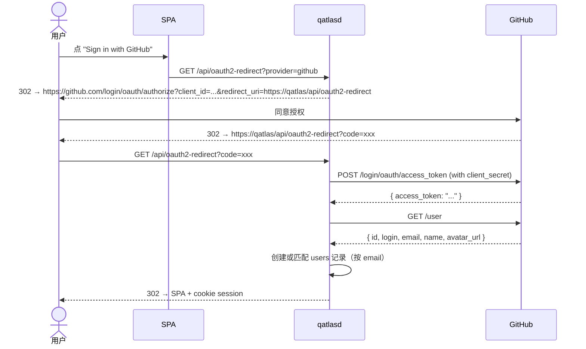

# GitHub OAuth 接入

QuantumAtlas 用 PocketBase 内嵌 GitHub OAuth 做用户登录。这一节讲：怎么建 OAuth App、怎么配 server、多边缘节点的多 App 策略。

## 一次性配置

### 1. 在 GitHub 创建 OAuth App

去 <https://github.com/settings/developers>（个人）或 <https://github.com/organizations/<ORG>/settings/applications>（组织）→ **New OAuth App**：

| 字段 | 填什么 |
|---|---|
| **Application name** | `QuantumAtlas (Edge 1)` 之类（多边缘时按线路区分）|
| **Homepage URL** | `https://atlas.example.com` |
| **Authorization callback URL** | `https://atlas.example.com/api/oauth2-redirect` |

!!! warning "callback URL 必须精确匹配"
    server 上启用 OAuth 时只接受配置里那个 callback URL；DNS 转跳、subdomain 切换都会让 OAuth 失败。

创建后会拿到 **Client ID**（公开）和 **Client Secret**（机密）—— secret 只显示一次，立即复制。

### 2. 写到 server `.env`

```bash title=".env"
GITHUB_CLIENT_ID=Ov23liXXXXXXXXXXXXXX
GITHUB_CLIENT_SECRET=ghxxxxxxxxxxxxxxxxxxxxxxxxxxxxxxxxxxxxxxxxxx
```

### 3. 重启 server

```bash
sudo systemctl restart qatlasd
```

启动时 `internal/auth/oauth.go::Register` 会把这两个值注入 PocketBase users collection 的 OAuth2 providers 设置——**无需手动在 admin UI 配**。

### 4. 验证

```bash
# 检查 OAuth provider 已生效
curl https://<your-server>/api/collections/users/auth-methods | jq
# 应该看到 .oauth2.providers[] 里有 "github" 条目
```

或浏览器打开 `https://<your-server>/` → 应该有 "Sign in with GitHub" 按钮。

## 用户首次登录流程



首次登录会**自动创建 users 记录**。之后浏览器 SPA 内自动持有 session（`pb.authStore`，无需手动 copy）；非浏览器调用请在 `/pat` 页面创建 PAT 后使用。

## Admin 提权（计划中）

`.env` 的 `QATLAS_ADMIN_GITHUB_LOGINS=alice,bob` 字段**当前未实现**——设置不会影响行为。未来打算用它在 OAuth 回调时给名单内的 GitHub login 自动提为 admin。

如果**现在**需要 admin，用 server CLI 改 PocketBase 内置 superuser：

```bash
qatlasd superuser upsert your-admin@example.com NewSecurePass
```

然后 `https://<server>/_/` 用这个邮箱密码登录 admin UI。

## 多边缘节点

**GitHub 限制每个 OAuth App 只允许一个 callback URL**，所以多台边缘部署时**必须为每台各建一个 OAuth App**：

| 边缘 | OAuth App name | Callback URL | client_id 写在哪 |
|---|---|---|---|
| Edge 1 | QuantumAtlas (Edge 1) | `https://edge1.example.com/api/oauth2-redirect` | Edge 1 的 `.env` |
| Edge 2 | QuantumAtlas (Edge 2) | `https://edge2.example.com/api/oauth2-redirect` | Edge 2 的 `.env` |

各边缘启动时只注入自己那一份 OAuth provider，互不冲突。**同一 GitHub 账号在多边缘各登一次会建多条 users 记录**（不同 user id），PAT 也是独立的。

## 排查

!!! failure "Sign in with GitHub 按钮没出现"
    `GITHUB_CLIENT_ID` / `GITHUB_CLIENT_SECRET` 没设；或设了但 server 没 restart。检查：

    ```bash
    journalctl -u qatlasd | grep -i oauth
    # 应该有 "oauth: registered github provider" 之类日志
    ```

!!! failure "登录跳到 GitHub 后回来 404 / 500"
    callback URL 不匹配。GitHub OAuth App 设置里改成跟实际访问的 server URL 完全一致。

!!! failure "登录后看不到 admin UI"
    OAuth 登录的是 users collection（普通用户），不是 PocketBase 内置 superuser。要 admin UI 用 `qatlasd superuser upsert` 建。

!!! failure "登录后 cookie 没设上"
    server 在反代后面但反代没 forward cookie / 没 preserve Host。看 [反向代理](reverse-proxy.md) 的三条铁律。

## 安全建议

- **Client Secret 视同密钥**：不进 git，存 secrets manager / vault；rotate 时去 GitHub App 设置页面点 "Generate a new client secret"。
- **callback URL 不要带通配符**：精确匹配。
- **OAuth scope 默认只有 `read:user`**——QuantumAtlas 只需要 email + login。不会 access 你的 repo。

## 跟 caddy-security 风格 SSO 共存

如果你的反代上已经挂了 caddy-security 或其他 SSO portal（颁发 JWT、注入 `X-Token-Subject` 头），它跟 PocketBase OAuth 是**正交**的——caddy-security 管"谁能访问反代"，PocketBase OAuth 管"谁是 QuantumAtlas 用户"。两层都过才能用写口（一层鉴权 + 一层凭据）。

如果 caddy-security 拦了 `/api/oauth2-redirect` 路径，要专门放行：

```caddyfile
# 在 caddy-security 的 authentication 块之前插
handle /api/oauth2-redirect {
    reverse_proxy 127.0.0.1:4200 { header_up Host {host} }
}

# 才是 caddy-security 的 authorize
handle /api/* {
    authorize with quantum_atlas_policy
    reverse_proxy 127.0.0.1:4200 { header_up Host {host} }
}
```

详见 [反向代理](reverse-proxy.md)。
