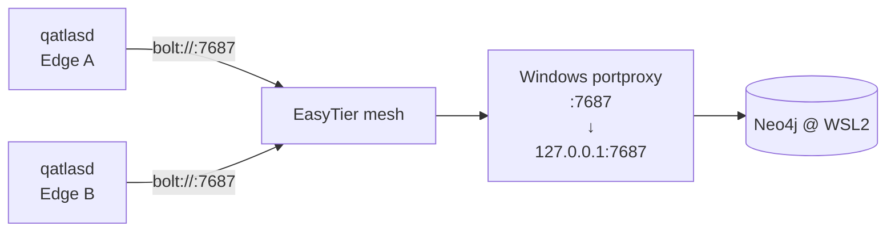

# Neo4j 接入

Neo4j 是 QuantumAtlas 的图数据库，存算法 / 原语 / 论文 / 人物的关系网。**Wiki 是 source of truth，Neo4j 是从 Wiki 派生**——可以随时重建。

## 你需要多少 Neo4j

| 部署形态 | 选哪个 |
|---|---|
| 个人 / 实验室 | 本机 Docker 起一个 Neo4j Desktop / Community 实例 |
| 生产单机 | apt 装 Neo4j Community 跑 systemd |
| **多边缘 active-active** | 一台中心 Neo4j 跨 mesh 暴露给所有边缘 |
| 不想要图谱功能 | **不装也行**——`/api/graph/*` 会返回 `{"error":...}` 200 / `/api/health` 报 `not_configured` |

## 最简：Docker

```bash
docker run -d --name neo4j \
    -p 7474:7474 -p 7687:7687 \
    -e NEO4J_AUTH=neo4j/your-strong-password \
    -v $HOME/.local/share/neo4j/data:/data \
    -v $HOME/.local/share/neo4j/logs:/logs \
    neo4j:5.26
```

访问 <http://localhost:7474> 用 `neo4j` / `your-strong-password` 登录浏览器。

server `.env`：

```bash
NEO4J_URI=bolt://localhost:7687
NEO4J_USERNAME=neo4j
NEO4J_PASSWORD=your-strong-password
# NEO4J_DATABASE=neo4j  # 可选，默认 "neo4j"
```

重启 server，看 `/api/health` 里 `checks.neo4j.status` 应该变成 `"ok"`。

## apt 装（Ubuntu / Debian）

```bash
# 加 GPG key + repo
wget -qO- https://debian.neo4j.com/neotechnology.gpg.key | sudo apt-key add -
echo 'deb https://debian.neo4j.com stable 5' | sudo tee /etc/apt/sources.list.d/neo4j.list
sudo apt update
sudo apt install neo4j

# 配置（编辑 /etc/neo4j/neo4j.conf）
# 至少改：
#   server.bolt.listen_address=0.0.0.0:7687    # 取消注释 + 改 0.0.0.0
#   server.jvm.additional=-Djava.net.preferIPv4Stack=true   # 末尾加这一行

# 初始密码
sudo neo4j-admin dbms set-initial-password "your-strong-password"

# 启动
sudo systemctl enable --now neo4j
sudo systemctl status neo4j
```

确认监听：

```bash
ss -tlnp | grep :7687
# 必须看到 0.0.0.0:7687（不是 *:7687）
```

!!! warning "WSL2 / dual-stack 坑"

    WSL2 里如果不加 `server.jvm.additional=-Djava.net.preferIPv4Stack=true`，JVM 默认 dual-stack v6 socket，`ss` 显示 `*:7687`，**Windows host 的 portproxy 转 v4 SYN 进来直接 RST**。

    两条配置缺一不可：

    ```ini
    server.bolt.listen_address=0.0.0.0:7687
    server.jvm.additional=-Djava.net.preferIPv4Stack=true
    ```

## 跨 mesh 暴露给多边缘节点

如果 qatlasd 和 Neo4j **不在同一台机**（典型场景：Neo4j 跑在团队后端 WSL2，qatlasd 跑在远端 edge VPS），需要把 Neo4j 通过 EasyTier mesh 暴露：



Windows host portproxy 配置（一次性，永久）：

```powershell
# 以管理员 PowerShell 跑
netsh interface portproxy add v4tov4 \
    listenport=7687 listenaddress=<mesh-host> \
    connectport=7687 connectaddress=127.0.0.1
```

每台 qatlasd `.env`：

```bash
NEO4J_URI=bolt://<neo4j-bolt-host>:7687
NEO4J_USERNAME=neo4j
NEO4J_PASSWORD=your-strong-password
```

## 验证连通

server 起来后：

```bash
# health check 反映
curl http://127.0.0.1:4200/api/health | jq .data.checks.neo4j

# 也可以直接打 graph endpoint 触发一次 Bolt 连接
curl http://127.0.0.1:4200/api/graph/stats | jq
# {
#   "nodes": 0, "relationships": 0,
#   "labels": [], "label_counts": {}
# }
```

如果返回 `{"error": "..."}`，看 error 内容：

| Error | 原因 |
|---|---|
| `connection refused` | Neo4j 没起或端口没暴露 |
| `authentication failure` | 密码错 |
| `database not found: xxx` | `NEO4J_DATABASE` 设了不存在的数据库 |
| `context deadline exceeded` | 网络 / mesh 不通 |

## 初次 sync Wiki 到 Neo4j

Server 启动时**不会**自动 sync。Wiki → Neo4j 的派生是**服务端职责**：Go
``qatlasd`` 持有 Neo4j 连接，基于 canonical Wiki（source of truth）重建图谱。
Python 客户端不再直连 Neo4j，也没有客户端 sync 命令。

后续 Wiki 通过 `POST /api/wiki/sync/pull` 触发 git pull 时，**会顺带 refresh in-memory cache**。完整 sync 策略见 [数据流 / Wiki→Neo4j](../concepts/data-flow.md#wiki-neo4j)。

## 备份

```bash
# Stop neo4j first（一致性 backup）
sudo systemctl stop neo4j
sudo neo4j-admin database dump neo4j --to-path=/var/backups/neo4j-$(date +%F).dump
sudo systemctl start neo4j
```

恢复：

```bash
sudo systemctl stop neo4j
sudo neo4j-admin database load neo4j --from-path=/var/backups/neo4j-2026-05-29.dump
sudo systemctl start neo4j
```

或者**不备份图数据库**——反正它是从 Wiki 派生的，挂了就重 sync。

## Cypher 例子（探索）

```cypher
// 列所有算法 + 它们用的原语
MATCH (a:Algorithm)-[:USES]->(p:Primitive)
RETURN a.id AS algo, collect(p.id) AS primitives

// 找最常被引用的论文
MATCH (paper:Paper)<-[:CITES|:REFERENCES]-(other)
RETURN paper.id, count(other) AS refs
ORDER BY refs DESC
LIMIT 10

// 找 Shor 算法的所有依赖
MATCH path = (a:Algorithm {id:"algo-shor"})-[:USES*1..3]->(p)
RETURN path
```

通过 server 跑：

```bash
curl -X POST https://<server>/api/graph/query \
  -H "Content-Type: application/json" \
  -d '{"query":"MATCH (a:Algorithm) RETURN a.id LIMIT 5"}'
```

或浏览器打开 Neo4j Browser <http://localhost:7474> 直接跑。

## 硬件 / 容量建议

Neo4j 是图数据库，瓶颈在**内存**（JVM heap 决定可热查询的子图大小），CPU 一般够、磁盘极小：

| 资源 | 当前 QuantumAtlas 规模（万级节点） | 团队规模（10 万级） |
|---|---|---|
| **JVM heap（内存）⭐** | 1 GB | 4 GB |
| **CPU** | 2 核 | 4 核 |
| **磁盘** | < 200 MB | < 2 GB |
| **网络** | 不敏感（结果集小） | 同左 |

> 选机器优先选**内存大**的，其次 CPU；磁盘随便。游戏机改 server / 二手工作站 / 中端 VPS 都合适。

Heap 调整方法：

- **apt 装的 systemd Neo4j**：编辑 `/etc/neo4j/neo4j.conf` 加 / 改 `server.memory.heap.max_size=4G`，`sudo systemctl restart neo4j`
- **docker compose 全家桶**：改 `.env` 的 `NEO4J_HEAP=4G`，`docker compose up -d neo4j`
- **docker 单 image**：`docker run -e NEO4J_server_memory_heap_max__size=4G ...`

## 分离部署：Neo4j 放另一台机

跟 [对象存储分离](rustfs.md#分离部署对象存储放另一台机) 同理 —— Neo4j Bolt 端口（7687）跨机 / 跨 mesh 暴露给 qatlasd 即可。已有 §「[跨 mesh 暴露给多边缘节点](#跨-mesh-暴露给多边缘节点)」详细 portproxy 教程，本节不重复。

适合**单独 Neo4j 机器**的设备：

- 内存大的二手工作站 / 游戏机（16-32 GB RAM 是甜点；Neo4j 单进程吃内存）
- 内存型 VPS（云服务商的 "memory-optimized" instance type）
- 已有 NAS 但 CPU/IO 不太够 → Neo4j 放在 NAS 旁边的小机器，存对象走 NAS

NUC / 树莓派 5 也跑得动小规模图（1 GB heap，万级节点），适合 home lab。

## 安全：`/api/graph/query` 的 Cypher 无代价上限（已接受的风险）

`/api/graph/stats`、`/api/graph/schema`、`/api/graph/query` 三个图端点都要
`authGuard + graph:read`（知识库不再匿名可读，详见
[鉴权模型](../concepts/auth-model.md)）。其中 `/api/graph/query` 风险最高：它接收
调用方提供的 Cypher，**只做只读约束（`ExecuteRead`），不设查询代价上限**。一条病态
查询（如无界笛卡尔积、深层变长路径）能吃满 Neo4j CPU / 内存。

**这是明确的设计取舍，不是待修复项**：过了 `graph:read` 鉴权即「自己人」（登录用户
或显式勾了 `graph:read` 的 PAT 持有者），同一个人本就能直连 Bolt 跑同样的查询，应用层
加限制器只增复杂度、挡不住真想跑重查询的人。运维侧的缓解手段：

- **撤销凭据**：删掉出问题的 PAT（`DELETE /api/pat/{id}`）或登出对应用户，这是唯一的应用层止血。
- **Neo4j 侧兜底**（可选，不在 qatlas 配置范围）：`/etc/neo4j/neo4j.conf` 可设
  `db.transaction.timeout`（事务超时）、`dbms.memory.transaction.total.max`（单事务内存上限）
  给 JVM 自身加护栏。这属于 Neo4j 运维而非 qatlas 应用层。

## 完全不要图谱也行

设 `NEO4J_URI=` 留空 / 不写。结果：

- `/api/health` 报 `neo4j: not_configured`（不下拉聚合等级）
- `/api/graph/*` endpoint 返回 `{"error":"NEO4J_URI not configured"}` 200
- Wiki 的 `[[page-id]]` 链接仍工作（不依赖 Neo4j）
- SPA 的 "Graph" 标签页空着

适合论文知识库 + Wiki 已经够用的场景。
