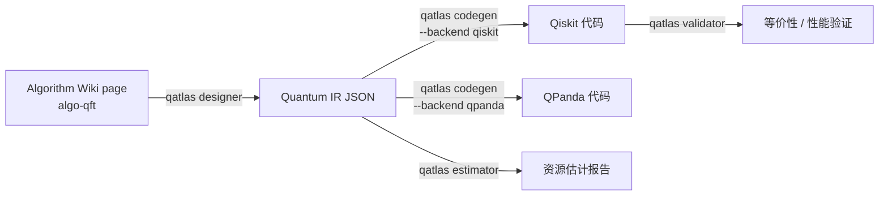

# 电路工具链

从 Wiki 里描述的算法走到能跑的代码，分四步：**designer → codegen → validator → estimator**。每一步都是独立 CLI，输入/输出是文件（JSON / Python / Markdown），所以可以缓存 / 替换 / 单步迭代。



## 前置条件

- 装 client（不需要 token，全是 local 工具）：

    ```bash
    uv tool install quantum-atlas
    ```

- Wiki 仓库已 clone 到默认位置（看 [写 Wiki 页面](write-wiki-pages.md) 的前置）
- （可选）Neo4j 连接，如果想从图谱查算法依赖

## 1. Designer：从算法到 IR

```bash
qatlas designer algo-qft -o circuit_ir.json
```

`algo-qft` 是 Wiki 里的 algorithm page id。Designer 读它的描述（含 `related: [prim-*]` 字段、正文里的 `[[prim-*]]` 引用），结合 [primitive composer](#) 组装出 Quantum IR。

输出 `circuit_ir.json` 是统一中间格式：

```json
{
  "name": "qft",
  "n_qubits": 4,
  "parameters": {"n": 4},
  "operations": [
    {"gate": "H", "qubits": [0]},
    {"gate": "CRZ", "qubits": [0, 1], "params": {"angle": "pi/2"}},
    ...
  ],
  "meta": {...}
}
```

完整 flags：

| Flag | 默认 | 含义 |
|---|---|---|
| `<algorithm_id>` (positional) | — | Wiki 里的 algorithm page id |
| `-o <path>` | stdout | IR 输出文件 |
| `--n-qubits N` | 算法默认 | 覆盖问题规模 |
| `--params k=v,...` | — | 额外参数 |
| `--no-optimize` | false | 跳过基本优化（gate 合并 / 重排）|

## 2. Codegen：从 IR 到代码

```bash
qatlas codegen circuit_ir.json --backend qiskit -o qft.py
qatlas codegen circuit_ir.json --backend qpanda -o qft.cpp
```

支持的 backend：

| Backend | 输出 | 框架版本 |
|---|---|---|
| `qiskit` | Python (.py) | Qiskit 1.0+ |
| `qpanda` | C++ (.cpp) | QPanda 2 |

完整 flags：

| Flag | 默认 | 含义 |
|---|---|---|
| `<ir_file>` (positional) | — | 上一步 designer 输出 |
| `--backend qiskit\|qpanda` | qiskit | 目标后端 |
| `-o <path>` | stdout | 代码输出文件 |
| `--include-imports` | true | 是否包含 `import` 头 |
| `--measure-all` | false | 自动末尾加 measure all |

## 3. Validator：验证正确性

```bash
# 跟参考实现比对
qatlas validator circuit_ir.json --compare-with qft

# 验证生成的 Qiskit 代码与 IR 等价
qatlas validator circuit_ir.json --check-codegen qft.py
```

底层用 unitary 等价性 / 状态向量比对 / 测量分布 KS 检验等多种方式（取决于电路规模）。

完整 flags：

| Flag | 默认 | 含义 |
|---|---|---|
| `<ir_file>` (positional) | — | 待验证 IR |
| `--compare-with <algo_id>` | — | 跟 Wiki 里参考算法对比 |
| `--check-codegen <code_file>` | — | 验代码与 IR 等价 |
| `--method unitary\|statevector\|sampling` | auto | 验证方法 |
| `--n-shots 1024` | 1024 | sampling 方法的次数 |

## 4. Estimator：资源估计

```bash
qatlas estimator circuit_ir.json --format markdown -o report.md
```

报告内容（Markdown / JSON）：

- gate 计数（按类型）
- depth（电路深度）
- two-qubit gate 数（实际硬件成本主要来源）
- 估计 wall time / fidelity（如果给了 hardware 模型）

完整 flags：

| Flag | 默认 | 含义 |
|---|---|---|
| `<ir_file>` (positional) | — | 待估计 IR |
| `--format markdown\|json` | markdown | 输出格式 |
| `-o <path>` | stdout | 输出文件 |
| `--hardware <name>` | — | 加载 hardware profile（影响 wall time / fidelity 估算）|
| `--detailed` | false | 加按 gate 类型的详细 breakdown |

## 端到端示例

```bash
# Wiki 里挑个算法
qatlas wiki show algo-qft | head -20

# 设计 → 生成 Qiskit → 估计资源
qatlas designer algo-qft --n-qubits 8 -o /tmp/qft.json
qatlas codegen /tmp/qft.json --backend qiskit -o /tmp/qft.py
qatlas estimator /tmp/qft.json --format markdown -o /tmp/qft-report.md

cat /tmp/qft-report.md
```

## 跟 Wiki / 图谱配合 { #explore-graph }

Designer 在内部查 Neo4j 找 algorithm → primitive 依赖关系。如果你的 server 配了 Neo4j 但本地 client 没连，**Designer 仍工作**——降级用 Wiki frontmatter 的 `related: [prim-*]`。

想让 Designer 走 server：

```bash
qatlas designer algo-qft --use-server-graph
```

会通过 `/api/graph/query` 查依赖。需要 server 端 Neo4j 在线。

## 跟其他工具集成

`circuit_ir.json` 是开放 schema，可以喂给非 QuantumAtlas 的工具：

- 写转换器到 OpenQASM / Cirq
- 直接 import 进 Jupyter 做 visualization
- 喂给自家电路优化器再 codegen

schema 文档在 `atlas/designer/quantum_ir.py`（Python 源码定义）。

## 下一步

- 想做新的 algorithm Wiki 页面？[写 Wiki 页面](write-wiki-pages.md)
- 想用图谱关系？[Neo4j 部署](../deployment/neo4j.md)
