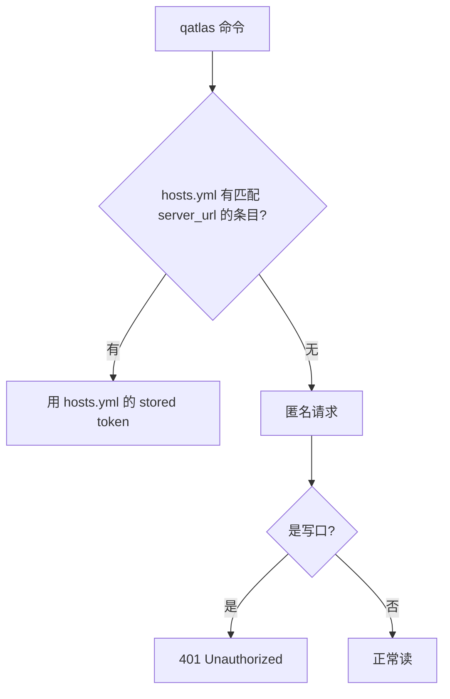

# 管理凭据

QuantumAtlas 用 **PocketBase session token (JWT)** 和 **Personal Access Token (PAT)** 两种凭据。这一节讲实操：怎么拿、怎么存、CLI/CI 怎么用、轮换 / 撤销怎么做。

完整鉴权模型（authGuard / scopeGuard 等）见 [鉴权模型](../concepts/auth-model.md)。

## 何时用 session 何时用 PAT { #pat-vs-session }

| 场景 | 选哪个 | 理由 |
|---|---|---|
| 浏览器 SPA 里点点点 | session | 自动续期，开浏览器就有 |
| `curl` / 单次脚本 | session 也行 | 14d 寿命对单次足够 |
| **长跑 CLI / agent** | **PAT** | 365d 寿命；丢了能单独 revoke |
| **CI workflow** | **PAT**，存 GitHub secret | scope 可裁剪，公开 repo 也不泄密 |
| 写 PAT 管理脚本（`/api/pat`）| **session** | server 强制——leaked PAT 不能再 mint PAT |

## 创建 PAT { #mint-pat }

=== "CLI（推荐）"

    自 v0.18 起 `qatlas auth login` 走标准 OAuth Device-Code 流程，本机 / SSH 远端体验一致，不用手粘 token：

    ```bash
    qatlas auth login -s quantum-atlas.ai
    # 1) CLI 调 POST /api/oauth/device/code 拿一个 8 位 user_code +
    #    带 user_code 的深链 https://<host>/<lang>/device?user_code=WDJB-MJHT
    # 2) CLI 自动打开本机浏览器到那个深链（SSH / headless 用 --no-browser
    #    就只打印 URL，让你自己复制到任意有浏览器的设备）
    # 3) 浏览器侧若没登录会先走 GitHub OAuth；登录后看到 Authorize 表单，
    #    可以在浏览器里编辑 scope（默认全勾）/ 名称 / 过期天数，点 Approve
    # 4) CLI 每 5s 轮询 POST /api/oauth/device/token，approve 后立刻拿到
    #    明文 PAT 写进 hosts.yml，结束
    ```

    打印示例：

    ```text
    Logging into quantum-atlas.ai via https://quantum-atlas.ai.

    To finish logging in, open this URL in a browser:
      https://quantum-atlas.ai/device
    and enter the code:  WDJB-MJHT
    (or open the deep link: https://quantum-atlas.ai/device?user_code=WDJB-MJHT)

    Waiting for approval (up to 600s, polling every 5s)…

    ✓ Logged in to quantum-atlas.ai
      Token:   qat_abcd********
      Name:    qatlas-cli-laptop-2026-06-03
      Scopes:  wiki:read, papers:read, papers:write, graph:read, wiki:write
      Expires: 2026-09-01
    ```

    flag（全部可选）：

    | Flag | 默认 | 作用 |
    |---|---|---|
    | `--no-browser` | 关 | 不调 `webbrowser.open`，只打印 URL；headless / SSH 远端用 |
    | `--scopes a,b,c` | 空 | **预填**到浏览器表单的 scope 列表；空 = 默认全勾，用户可自行取消 |
    | `--expires-days N` | `90` | 预填的过期天数 (1–365)；浏览器里可改 |
    | `--token-name NAME` | `qatlas-cli-<host>-<YYYY-MM-DD>` | 预填的 token 名；浏览器里可改 |
    | `--timeout SEC` | `600` | CLI 等浏览器 approve 的最大秒数 |
    | `--insecure` | 关 | 信任自签证书（如用 `tls internal` 的 IP 入口边缘） |
    | `--with-token` | — | CI 旁路：从 stdin 读 PAT（`cat token \| qatlas auth login -s <host> --with-token`），跳过 OAuth 直接存进 hosts.yml；secret 不进 argv / shell history（跟 `gh auth login --with-token` 同款设计） |

    所有 CLI 参数都只是**预填**，最终 token 的 name / scopes / expires 以浏览器里点 Approve 时表单上的值为准——浏览器始终是 source of truth。

=== "device-code（SSH 远端 / 无 GUI 机器）"

    跟默认流程是同一条命令，只是加 `--no-browser` 让 CLI 别试着开本机浏览器：

    ```bash
    qatlas auth login --no-browser -H quantum-atlas.ai
    ```

    输出：

    ```text
    To finish logging in, open this URL in a browser:
      https://quantum-atlas.ai/device
    and enter the code:  WDJB-MJHT
    (or open the deep link: https://quantum-atlas.ai/device?user_code=WDJB-MJHT)

    Waiting for approval (up to 600s, polling every 5s)…
    ```

    在**任何能开浏览器的设备**（手机、自己工位、隔壁同事的电脑都行）打开那个深链，按 Approve。CLI 这边轮询 `/api/oauth/device/token` 拿到 token 后自动写 hosts.yml。

    用户 code 在 10 分钟内未 approve 会过期；过期了重跑命令即可。

=== "浏览器（自助创建 / 给别的工具用）"

    跟 `qatlas auth login` 走的是同一个 `/pat` 页面，区别只是没人通过 CLI 起 device-code flow：

    1. 打开 `https://<server>/pat`
    2. 用 GitHub 登录（首次会问 OAuth 授权）
    3. 点 **New token**
    4. 填：
        - **Name**：人类可读，例如 `ci-upload-2026`
        - **Expires in days**：1–365
        - **Scopes**：自 v0.18 起默认全勾，取消不想要的即可
    5. 点 Create
    6. **立即复制以 `qat_` 开头的明文**（不会再显示）

    需要写进 client hosts.yml 让 CLI 用？`echo qat_xxx | qatlas auth login -s <host> --with-token` 一条命令搞定。

=== "server CLI（运维 / 救急）"

    在 server 主机上：

    ```bash
    qatlasd pat mint \
        --user user@example.com \
        --name "emergency-fix" \
        --scopes papers:write,wiki:read \
        --expires-in-days 7
    ```

    输出包含明文（仅此一次）。用于绕开 OAuth 故障时给指定用户发 token。

## 存 PAT { #store-pat }

=== "本地长期（推荐）"

    `qatlas auth login` 完成后自动落 `~/.config/qatlas/hosts.yml`（mode 0600）。之后所有 `qatlas` 命令针对该 host 自动用这个 PAT。

    **支持多 host**：

    ```bash
    qatlas auth login -s atlas.example.com
    qatlas auth login -s atlas-edge2.example.com
    qatlas auth status
    # atlas.example.com
    #   ✓ Logged in (stored at ~/.config/qatlas/hosts.yml)
    #   - Token type:  PAT
    #   - Token value: qat_xxx********
    # atlas-edge2.example.com
    #   ...
    ```

=== "CI / GitHub Actions"

    repo Settings → Secrets → 加 `QATLAS_TOKEN` = PAT 明文，然后在 step 里用 `qatlas auth login --with-token` 从 stdin 注入 hosts.yml：

    ```yaml title=".github/workflows/upload.yml"
    - name: Configure qatlas
      env:
        QATLAS_TOKEN: ${{ secrets.QATLAS_TOKEN }}
      run: |
        uv tool install quantum-atlas
        qatlas config set server_url https://quantum-atlas.ai
        echo "$QATLAS_TOKEN" | qatlas auth login -s quantum-atlas.ai --with-token   # 从 stdin 读，不进 history

    - name: Upload to QuantumAtlas
      run: |
        qatlas upload pdf 2501.00010v1 --pdf paper.pdf --overwrite
    ```

    > v0.17.0 起 client 不再读 `QATLAS_TOKEN` 等 env，**必须**经 `qatlas auth login --with-token` 中转到 hosts.yml。v0.19.0 还删了 `qatlas config set token` 路径（config.yaml `token:` 字段会静默盖 hosts.yml 里所有 per-host token，是 footgun）。

## token 解析优先级 { #precedence }



v0.19.0+：单层（hosts.yml > 匿名）。不再支持 `--token` flag / `QATLAS_TOKEN` env / config.yaml `token:` 字段。`server_url:` 字段（config.yaml）决定查 hosts.yml 时用哪个 host 当 key。

## 通用 client flag { #client-flags }

所有 `qatlas <subcmd>` 共享的 flag：

| Flag | 默认 | 作用 |
|---|---|---|
| `--request-timeout 120.0` | 120s | 单 HTTP 请求超时（per-call ergonomic）|

> v0.17.0 删了 `--base-url` / `--token` / `--insecure` — server URL / TLS 选项必须写进 `~/.config/qatlas/config.yaml`（`server_url:` / `insecure:` 两个字段）。理由：client 是短命令多次调用，每次重复指 server 反而烦；YAML 单入口跟 `gh` / `kubectl` 主流认知一致。token 走 hosts.yml + `qatlas auth login` 单独管理。

## 查 / 撤销 PAT

=== "浏览器"

    `https://<server>/pat` 列出全部 PAT，每行有 Revoke 按钮。点了**立即生效**（server 端 invalidate cache，单边缘 ms 级；跨边缘 60s 内）。

=== "CLI（server 主机）"

    ```bash
    # 列你管理的所有用户的所有 PAT
    qatlasd pat list

    # 列单一用户
    qatlasd pat list --user user@example.com --json

    # 撤销
    qatlasd pat revoke <id>
    ```

=== "API"

    ```bash
    # 必须用 session token（PAT 不能改 PAT）
    curl -X DELETE https://<server>/api/pat/<id> \
      -H "Authorization: Bearer $SESSION_TOKEN"
    ```

## 轮换 PAT

到期前一周收到提醒？批量轮换：

```bash
# 旧 PAT 还能用 7d，先看现在哪些 host 用了 token
qatlas auth status

# 跑 login —— 自动开浏览器走 OAuth + Approve，生成的新 PAT 直接覆盖
# hosts.yml 里同 host 的旧条目；scope / 过期天数想改就在浏览器对话框里改
qatlas auth login -s quantum-atlas.ai --scopes papers:write --expires-days 90

# 验证新 PAT
qatlas wiki list --limit 1   # 应该正常返回
# 旧 PAT 上 /pat 页面 revoke
```

CI 这边更新 GitHub secret 后下次 workflow 跑就用新的。

## 常见陷阱

!!! failure "401 Unauthorized 但我配了 PAT"
    检查 token 是否过期：`/pat` 页面看 expires_at。如果是 session token (JWT)，14 天到期需要重登。

!!! failure "403 insufficient scope: this token lacks papers:write"
    PAT 创建时没勾 `papers:write`。要么 revoke + 重建带 scope 的，要么用 session token。

!!! failure "403 this endpoint requires a browser session token"
    你在用 PAT 调 `/api/pat` —— **这条不通**。`/api/pat` 只接受 session token（浏览器登录后 `pb.authStore` 自动持有），有意为之防止 leaked PAT 自我复制。需要管理 PAT 请在浏览器 SPA 内打开 `/pat` 页操作。

!!! failure "401 在另一台边缘用本机的 PAT"
    PocketBase 各边缘独立，PAT 不跨节点。每条线路需要分别在该边缘登录、各自 mint PAT。

## hosts.yml 长什么样

```yaml title="~/.config/qatlas/hosts.yml"
hosts:
  atlas.example.com:
    token: qat_xxxxxxxxxxxxxxx
    added_at: "2026-05-29T01:23:45Z"
  atlas-edge2.example.com:
    token: qat_yyyyyyyyyyyyyyy
    added_at: "2026-05-29T01:23:50Z"
```

mode 600，归你。可以手 edit（但用 `qatlas auth login/logout` 更不容易出错）。

## 退出登录

```bash
qatlas auth logout -s atlas.example.com
# 删 hosts.yml 中此 host 条目（不调 server，只是本地清理）
```

如果想真"撤销" PAT，去 `/pat` 页面 revoke。
