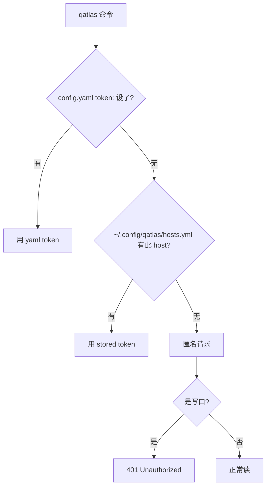

# 管理凭据

QuantumAtlas 用 **PocketBase session token (JWT)** 和 **Personal Access Token (PAT)** 两种凭据。这一节讲实操：怎么拿、怎么存、CLI/CI 怎么用、轮换 / 撤销怎么做。

完整鉴权模型（authGuard / scopeGuard 等）见 [鉴权模型](../concepts/auth-model.md)。

## 何时用 session 何时用 PAT { #pat-vs-session }

| 场景 | 选哪个 | 理由 |
|---|---|---|
| 浏览器 SPA 里点点点 | session | 自动续期，开浏览器就有 |
| `curl` / 单次脚本 | session 也行 | 14d 寿命对单次足够 |
| **长跑 CLI / agent** | **PAT** | 365d 寿命；丢了能单独 revoke |
| **CI workflow** | **PAT**，存 GitHub secret | scope 可裁剪，公开 repo 也不泄密 |
| 写 PAT 管理脚本（`/api/pat`）| **session** | server 强制——leaked PAT 不能再 mint PAT |

## 创建 PAT { #mint-pat }

=== "浏览器（推荐）"

    1. 打开 `https://<server>/pat`
    2. 用 GitHub 登录（首次会问 OAuth 授权）
    3. 点 **New token**
    4. 填：
        - **Name**：人类可读，例如 `ci-upload-2026`
        - **Expires in days**：1–365
        - **Scopes**：勾上需要的 —— `papers:write` 给上传，`wiki:read` 给读 wiki，等等
    5. 点 Create
    6. **立即复制以 `qat_` 开头的明文**（不会再显示）

    !!! warning "scope 默认空"
        什么都不勾的话这个 PAT 调任何写口都 403。**至少勾一个**。

=== "server CLI（运维 / 救急）"

    在 server 主机上：

    ```bash
    qatlasd pat mint \
        --user user@example.com \
        --name "emergency-fix" \
        --scopes papers:write,wiki:read \
        --expires-in-days 7
    ```

    输出包含明文（仅此一次）。用于绕开 OAuth 故障时给指定用户发 token。

## 存 PAT { #store-pat }

=== "本地长期（推荐）"

    存到 `~/.config/qatlas/hosts.yml`：

    ```bash
    qatlas auth login -H atlas.example.com
    # 粘贴 qat_xxx 明文（getpass 隐藏输入）
    ```

    文件权限自动设 0600。之后所有 `qatlas` 命令针对该 host 自动用这个 PAT。

    **支持多 host**：

    ```bash
    qatlas auth login -H atlas.example.com
    qatlas auth login -H atlas-edge2.example.com
    qatlas auth status
    # atlas.example.com
    #   ✓ Logged in (stored at ~/.config/qatlas/hosts.yml)
    #   - Token type:  PAT
    #   - Token value: qat_xxx********
    # atlas-edge2.example.com
    #   ...
    ```

=== "yaml 配置（推荐 — 一次配长用）"

    把 token 写进 `~/.config/qatlas/config.yaml`（Linux 路径；mac / win 用 `qatlas config path` 查实际）：

    ```bash
    qatlas config set token qat_xxxxxx
    qatlas upload pdf 2501.00010v1 --pdf paper.pdf
    ```

    yaml 优先级高于 hosts.yml；token 持久化（不会因换 shell 丢）。完整子命令见 [CLI reference `qatlas config`](../reference/cli-qatlas.md#qatlas-config)。

=== "CI / GitHub Actions"

    repo Settings → Secrets → 加 `QATLAS_TOKEN` = PAT 明文，然后在 step 里用 `qatlas config set` 写进 yaml：

    ```yaml title=".github/workflows/upload.yml"
    - name: Configure qatlas
      env:
        QATLAS_TOKEN: ${{ secrets.QATLAS_TOKEN }}
      run: |
        uv tool install quantum-atlas
        qatlas config set server_url https://quantum-atlas.ai
        echo "$QATLAS_TOKEN" | qatlas config set token   # 从 stdin 读，不进 history

    - name: Upload to QuantumAtlas
      run: |
        qatlas upload pdf 2501.00010v1 --pdf paper.pdf --overwrite
    ```

    > v0.17.0 起 client 不再读 `QATLAS_TOKEN` 等 env，必须经 `qatlas config set` 中转。

## token 解析优先级 { #precedence }



v0.17.0+：精简到两层（yaml > hosts.yml > 匿名）。不再支持 `--token` flag、`QATLAS_TOKEN` env。

## 通用 client flag { #client-flags }

所有 `qatlas <subcmd>` 共享的 flag：

| Flag | 默认 | 作用 |
|---|---|---|
| `--request-timeout 120.0` | 120s | 单 HTTP 请求超时（per-call ergonomic）|

> v0.17.0 删了 `--base-url` / `--token` / `--insecure` — server URL / token / TLS 选项必须写进 `~/.config/qatlas/config.yaml`（`server_url:` / `token:` / `insecure:` 三个字段）。理由：client 是短命令多次调用，每次重复指 server 反而烦；YAML 单入口跟 `gh` / `kubectl` 主流认知一致。

## 查 / 撤销 PAT

=== "浏览器"

    `https://<server>/pat` 列出全部 PAT，每行有 Revoke 按钮。点了**立即生效**（server 端 invalidate cache，单边缘 ms 级；跨边缘 60s 内）。

=== "CLI（server 主机）"

    ```bash
    # 列你管理的所有用户的所有 PAT
    qatlasd pat list

    # 列单一用户
    qatlasd pat list --user user@example.com --json

    # 撤销
    qatlasd pat revoke <id>
    ```

=== "API"

    ```bash
    # 必须用 session token（PAT 不能改 PAT）
    curl -X DELETE https://<server>/api/pat/<id> \
      -H "Authorization: Bearer $SESSION_TOKEN"
    ```

## 轮换 PAT

到期前一周收到提醒？批量轮换：

```bash
# 旧 PAT 还能用 7d，先建新的
qatlas auth status   # 看现在哪些 host 用了 token
# 浏览器创建新 PAT，scope 不变
qatlas auth login -H quantum-atlas.ai
# 粘新 PAT —— 直接覆盖 hosts.yml 里的旧条目

# 验证新 PAT
qatlas wiki list --limit 1   # 应该正常返回
# 旧 PAT 上 /pat 页面 revoke
```

CI 这边更新 GitHub secret 后下次 workflow 跑就用新的。

## 常见陷阱

!!! failure "401 Unauthorized 但我配了 PAT"
    检查 token 是否过期：`/pat` 页面看 expires_at。如果是 session token (JWT)，14 天到期需要重登。

!!! failure "403 insufficient scope: this token lacks papers:write"
    PAT 创建时没勾 `papers:write`。要么 revoke + 重建带 scope 的，要么用 session token。

!!! failure "403 this endpoint requires a browser session token"
    你在用 PAT 调 `/api/pat` —— **这条不通**。`/api/pat` 只接受 session token（浏览器登录后 `pb.authStore` 自动持有），有意为之防止 leaked PAT 自我复制。需要管理 PAT 请在浏览器 SPA 内打开 `/pat` 页操作。

!!! failure "401 在另一台边缘用本机的 PAT"
    PocketBase 各边缘独立，PAT 不跨节点。每条线路需要分别在该边缘登录、各自 mint PAT。

## hosts.yml 长什么样

```yaml title="~/.config/qatlas/hosts.yml"
hosts:
  atlas.example.com:
    token: qat_xxxxxxxxxxxxxxx
    added_at: "2026-05-29T01:23:45Z"
  atlas-edge2.example.com:
    token: qat_yyyyyyyyyyyyyyy
    added_at: "2026-05-29T01:23:50Z"
```

mode 600，归你。可以手 edit（但用 `qatlas auth login/logout` 更不容易出错）。

## 退出登录

```bash
qatlas auth logout -H atlas.example.com
# 删 hosts.yml 中此 host 条目（不调 server，只是本地清理）
```

如果想真"撤销" PAT，去 `/pat` 页面 revoke。
