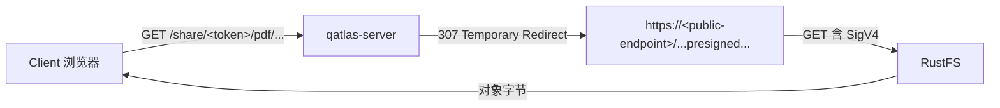

# 分享与下载

`POST /api/shares/` 创建一个**带过期时间的分享 token**，把指定路径的资产暴露成 `/share/<token>/<path>` 公开 URL。适合给协作者一个不需要登录、临时可访问的下载链接。

## 谁能创建

- 任何带 `shares:write` scope 的 PAT
- 任何 session 用户（隐式 `*` scope）

## 最小用例

```bash
# 用 PAT 创建一个 24 小时有效的分享，覆盖一篇论文的所有资产
curl -X POST https://<server>/api/shares/ \
  -H "Authorization: Bearer $QATLAS_TOKEN" \
  -H "Content-Type: application/json" \
  -d '{
    "paths": ["pdf/2501/2501.00010v1.pdf", "md/2501/2501.00010v1.md"],
    "label": "Share with reviewer A",
    "expires_in": 86400
  }'
```

返回：

```json
{
  "token": "abc123def456...",
  "url_prefix": "https://<server>/share/abc123.../",
  "paths": ["pdf/2501/2501.00010v1.pdf", "md/2501/2501.00010v1.md"],
  "created_at": "2026-05-29T03:00:00Z",
  "expires_at": "2026-05-30T03:00:00Z",
  "label": "Share with reviewer A"
}
```

之后任何人访问：

```
https://<server>/share/abc123.../pdf/2501/2501.00010v1.pdf
```

无需鉴权即可下载。

## 单文件 vs 目录

如果 `paths` 只有一个条目且是单文件，访问 `/share/<token>` 直接转发到该文件（PDF 直接打开）：

```bash
# 单文件分享：访问 token 根 = 直接拿文件
curl -L https://<server>/share/<token>
```

如果是多文件或包含目录前缀（如 `pdf/2501/2501.00010v1.pdf`），访问根会得到 HTML 索引页面，列出所有可访问条目。

## 怎么选 `paths`

`paths` 是相对 RawDir / bucket 根的 key（没有前导 `/`）。常见的：

| 用途 | path |
|---|---|
| 单篇 PDF | `pdf/2501/2501.00010v1.pdf` |
| 单篇 Markdown | `md/2501/2501.00010v1.md` |
| 单篇所有资产 | `pdf/2501/2501.00010v1.pdf` + `md/2501/2501.00010v1.md` + `json/2501/2501.00010v1.json`|
| 一个 cohort 所有 PDF | `pdf/2501/`（目录形式，访问 token 根 = HTML 索引）|

## TTL（`expires_in`）

| 值 | 行为 |
|---|---|
| `>0` 整数 | 秒数，到期后 410 Gone |
| `0` 或缺省 | 用 server 配置的 `QATLAS_DEFAULT_SHARE_EXPIRES_IN`，若仍为 0 = 不过期 |

!!! warning "不要轻易做不过期 share"
    不过期 share 一旦泄漏就只能 revoke。**默认给一个 TTL**——CI / 评审常用 86400（24h）或 604800（7d）。

## 列表 / 撤销

```bash
# 列出当前账号建的所有 share（需 shares:read scope）
curl https://<server>/api/shares/ -H "Authorization: Bearer $QATLAS_TOKEN" | jq

# 撤销
curl -X DELETE https://<server>/api/shares/<token> \
  -H "Authorization: Bearer $QATLAS_TOKEN"
```

撤销 = 删 token，下次 share 访问即返回 404。**已下载的文件无法撤回**——分享时心里要数。

## 公网 URL 是怎么形成的

S3 后端开启时，share 服务实际是：



server 给 client 一个 **307 redirect** 到 RustFS 公网 endpoint 的 presigned URL（5 分钟有效）。**没有字节通过 qatlas-server**——省 WAN 带宽。

如果是 LocalStore 后端（dev），share 直接从 server 流字节。

## 常驻 share token（可选）

```bash
# .env
QATLAS_SHARE_ACCESS_TOKEN=<某个长随机字符串>
```

配上之后，访问 `/share/<这个 token>/...` 永远有效（不存进 DB，不能 revoke——靠改 env + restart）。仅在你**确实需要稳定 URL** 时用（canonical paper assets / docs 引用）。

## 反代 / Caddy 配置

share 走 `/share/...` 路径，跟 API 同源。如果你前端用 Caddy：

```caddy
example.com {
    reverse_proxy 127.0.0.1:4200 {
        # 重要：preserve Host，否则 SigV4 presign 签名会失效
        header_up Host {host}
    }
}
```

详见 [反向代理模板](../deployment/reverse-proxy.md)。

## 完整 API 参考

字段 / 状态码全量在 [REST API 参考](../reference/rest-api.md#shares)。
