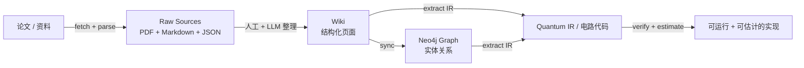

---
hide:
  - navigation
  - toc
---

# QuantumAtlas

**把量子算法论文从「PDF 和笔记」推进到「可查询的知识、可浏览的 Wiki、可同步的图谱，以及可生成的实现代码」。**

QuantumAtlas 是一个面向量子算法研究的**分层知识库 + 实现工作台**。它把论文摄入、Wiki 沉淀、图谱同步、电路设计、代码生成、验证和资源估计串成一条可持续迭代的链路。

核心想法：**分类和关联是两回事**。Raw Sources 保留证据，Wiki 是被审阅后的知识 source of truth，Neo4j 图谱回答「它与什么有关」。

---

## 我应该从哪里开始？

-   :material-rocket-launch:{ .lg .middle } **第一次使用？**

    ---

    装 client、跑一个不依赖外部服务的 demo、5 分钟看完核心数据流。

    [:octicons-arrow-right-24: 入门指南](getting-started.md)

-   :material-book-open-page-variant:{ .lg .middle } **想理解架构？**

    ---

    三层模型、数据流动、对象寻址、鉴权语义、多边缘部署。

    [:octicons-arrow-right-24: 架构与概念](concepts/index.md)

-   :material-school:{ .lg .middle } **来查怎么做某件事？**

    ---

    上传论文、写 Wiki 页面、跑 MinerU、生成电路代码、分享文件……

    [:octicons-arrow-right-24: 操作指南](guides/index.md)

-   :material-api:{ .lg .middle } **来查 API / CLI / 配置？**

    ---

    全 CLI 命令、REST API、环境变量、Wiki schema、错误码完整参考。

    [:octicons-arrow-right-24: 参考手册](reference/index.md)

-   :material-server:{ .lg .middle } **想部署一台服务？**

    ---

    安装、systemd、反向代理、OAuth、Neo4j、RustFS、健康检查、备份升级。

    [:octicons-arrow-right-24: 部署运维](deployment/index.md)

-   :material-hand-heart:{ .lg .middle } **想参与贡献？**

    ---

    代码、文档、Wiki 内容、发布流程，全在这里说清楚。

    [:octicons-arrow-right-24: 贡献指南](contributing.md)

---

## 它能做什么

- **从 arXiv 摄入论文**：自动抓取 PDF + 元数据，可选用 MinerU / PyMuPDF 解析为 Markdown
- **沉淀知识到 Wiki**：可审阅的 Markdown + YAML frontmatter，分 Concepts / Entities / Sources / Comparisons 四类
- **同步到 Neo4j 图谱**：从 Wiki 派生算法 / 原语 / 论文 / 人物的关系网
- **从算法走到代码**：Designer → Quantum IR → Qiskit/QPanda → Validator → Estimator
- **远程协作**：Web API + CLI + 分享链接，协作者不需要服务器登录权限
- **多边缘 active-active**：海外 / 国内多线路部署，跨地域共享同一份知识库

## 当前状态

!!! info "Alpha 阶段，主线已贯通"

    - 摄入、Wiki、图谱、设计、代码生成、验证、估计 **全链路打通**。
    - Web API、分享链接、远程协作流程 **可用**。
    - 项目定位是「可持续扩展的研究基础设施」，而不是已经产品化的平台——意味着稳定但仍在快速演化。

## 仓库 & 包

- :material-github: 源码：<https://github.com/IAI-USTC-Quantum/QuantumAtlas>
- :material-language-python: PyPI：[`quantum-atlas`](https://pypi.org/project/quantum-atlas/)
- :material-server-network: 生产入口：<https://quantum-atlas.ai>
- :material-license: 协议：[MIT](https://github.com/IAI-USTC-Quantum/QuantumAtlas/blob/main/LICENSE)
