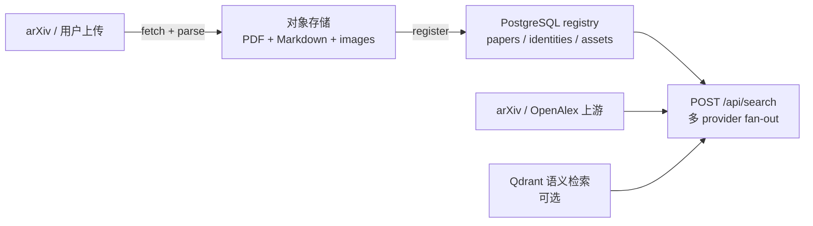

# QuantumAtlas

**面向量子算法研究的论文收集、多路检索与注册数据库。**

QuantumAtlas 从 arXiv 收集量子算法论文，把 PDF 解析成结构化资产（Markdown / 图片 / 元数据 JSON），把每一篇论文、每一个身份（arXiv ID / DOI / OpenAlex ID）、每一份资产登记进 PostgreSQL registry，再通过**一个搜索端点**回答查询——本地 catalog、arXiv、OpenAlex、可选的 Qdrant 语义向量检索，多路 fan-out 一次完成。

核心想法：**收集一次，全部登记，到处可搜**。原始资产进对象存储，论文 registry 进 PostgreSQL（boot 时 goose 自动迁移），搜索引擎跨范式查询而不需要你事先选边。

```mermaid
flowchart LR
    A[arXiv / 用户上传] -->|fetch + parse| R[对象存储<br/>PDF + Markdown + images]
    R -->|register| P[PostgreSQL registry<br/>papers / identities / assets]
    P & U[arXiv / OpenAlex 上游] --> S[POST /api/search<br/>多 provider fan-out]
    Q[Qdrant 语义检索<br/>可选] --> S
```

---

## 文档导航

文档按两个组件 + 共享基础组织：**Python 客户端 (`qatlas`)** 与 **Go 服务端 (`qatlasd`)** 各成一节，概念、参考、入门、贡献为两者共享。

-   :material-rocket-launch:{ .lg .middle } **入门**

    ---

    装 client、指向 server、拉第一篇论文；或 5 分钟把 qatlasd + PostgreSQL 跑起来。

    [:octicons-arrow-right-24: 入门指南](getting-started.md)

-   :material-book-open-page-variant:{ .lg .middle } **概念与架构**

    ---

    分层模型、数据流动、对象寻址、鉴权语义、存储边界。

    [:octicons-arrow-right-24: 概念](concepts/index.md)

-   :material-language-python:{ .lg .middle } **Python 客户端 `qatlas`**

    ---

    摄入论文、上传资产、跑 MinerU、拉取 PDF / Markdown、管理凭据。

    [:octicons-arrow-right-24: Python 客户端](client/index.md)

-   :material-server:{ .lg .middle } **Go 服务端 `qatlasd`**

    ---

    安装、systemd、反向代理、OAuth、PostgreSQL、RustFS、REST API、健康检查、备份升级。

    [:octicons-arrow-right-24: Go 服务端](server/index.md)

-   :material-file-tree:{ .lg .middle } **参考 / 数据格式**

    ---

    环境变量、arXiv ID 格式等跨组件的稳定约定。

    [:octicons-arrow-right-24: 参考](reference/index.md)

-   :material-hand-heart:{ .lg .middle } **贡献**

    ---

    代码、文档、发布流程。

    [:octicons-arrow-right-24: 贡献指南](contributing.md)

---

## 核心能力

- **从 arXiv 收集论文**：自动抓取 PDF + 元数据，可选用 MinerU 解析为 Markdown
- **PostgreSQL 论文 registry**：论文、身份（arXiv / DOI / OpenAlex）、资产状态全部入库，纯 SQL 可查；goose migrations 随 server 启动自动 apply
- **多范式搜索**：`POST /api/search` 一个端点 fan-out 到 catalog / arXiv / OpenAlex provider，可选 Qdrant 混合向量检索（dense+sparse, RRF + rerank）
- **懒加载摄入**：缓存未命中时 server 后台静默 fetch + 转换，LRO 状态可轮询，并发请求自动 dedupe
- **OpenAlex 语料镜像**：works 语料灌进同一个 PG 库，引用上下文 / 批量分析直接 SQL
- **远程协作**：Web API + CLI，协作者不需要服务器登录权限

## 当前状态

!!! info "Alpha 阶段，主干已贯通"

    - 论文收集、registry、多路搜索、懒加载摄入 **全链路打通**。
    - Web API 与远程协作流程 **可用**。
    - 项目定位是「可持续扩展的研究基础设施」，而不是已经产品化的平台——意味着稳定但仍在快速演化。

## 仓库 & 包

- :material-github: 源码：<https://github.com/IAI-USTC-Quantum/QuantumAtlas>
- :material-language-python: PyPI：[`quantum-atlas`](https://pypi.org/project/quantum-atlas/)
- :material-server-network: 生产入口：<https://quantum-atlas.ai>
- :material-license: 协议：[Apache-2.0](https://github.com/IAI-USTC-Quantum/QuantumAtlas/blob/main/LICENSE)
