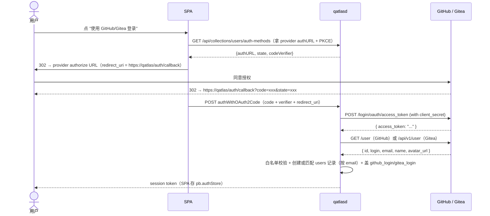

# GitHub / Gitea OAuth 接入

QuantumAtlas 用 PocketBase 内嵌 OAuth2 做用户登录，支持两个 provider：**GitHub**（必需）与 **Gitea/Forgejo**（可选，自建实例）。这一节讲：怎么建 OAuth App、怎么配 server、多边缘节点的多 App 策略。

两个 provider 的浏览器回调地址相同：SPA 的 `/auth/callback` 路由（`web/src/lib/auth.ts` 的手动 code exchange 流程），**不是** PocketBase 自带的 `/api/oauth2-redirect`。

## 一次性配置（GitHub）

### 1. 在 GitHub 创建 OAuth App

去 <https://github.com/settings/developers>（个人）或 <https://github.com/organizations/<ORG>/settings/applications>（组织）→ **New OAuth App**：

| 字段 | 填什么 |
|---|---|
| **Application name** | `QuantumAtlas (Edge 1)` 之类（多边缘时按线路区分）|
| **Homepage URL** | `https://atlas.example.com` |
| **Authorization callback URL** | `https://atlas.example.com/auth/callback` |

!!! warning "callback URL 必须精确匹配"
    server 上启用 OAuth 时只接受配置里那个 callback URL；DNS 转跳、subdomain 切换都会让 OAuth 失败。

创建后会拿到 **Client ID**（公开）和 **Client Secret**（机密）—— secret 只显示一次，立即复制。

### 2. 写到 server config.yaml

```yaml title="~/.qatlas/config.yaml"
auth:
  github_client_id: Ov23liXXXXXXXXXXXXXX
  github_client_secret: ghxxxxxxxxxxxxxxxxxxxxxxxxxxxxxxxxxxxxxxxxxx
  allowed_logins: [your-gh-login]   # 登录白名单，大小写不敏感
  admin_logins: [your-gh-login]     # 白名单成员 + 运维面 admin
```

### 3. 重启 server

```bash
sudo systemctl restart qatlasd
```

启动时 `internal/auth/oauth.go::Register` 会把这两个值注入 PocketBase users collection 的 OAuth2 providers 设置——**无需手动在 admin UI 配**。

### 4. 验证

```bash
# 检查 OAuth provider 已生效
curl https://<your-server>/api/collections/users/auth-methods | jq
# 应该看到 .oauth2.providers[] 里有 "github" 条目（配了 Gitea 则还有 "gitea"）
```

或浏览器打开 `https://<your-server>/` → 登录页应该有 "使用 GitHub 登录" 按钮。

## 一次性配置（Gitea，可选）

Gitea provider 面向**自建 Gitea/Forgejo 实例**（PocketBase 内置的 gitea provider 默认指向 gitea.com，qatlasd 会用 `gitea_url` 覆盖三个端点 URL）。

### 1. 在 Gitea 创建 OAuth2 App

以实例管理员或普通用户身份打开 `<你的 Gitea>/user/settings/applications` → **管理 OAuth2 应用程序** → 创建：

| 字段 | 填什么 |
|---|---|
| **应用名称** | `QuantumAtlas` |
| **重定向 URI** | `https://atlas.example.com/auth/callback` |

创建后拿到 **Client ID**（UUID 形如 `12345678-1234-1234-1234-123456789abc`）和 **Client Secret**（`gto_…`，只显示一次）。

### 2. 写到 server config.yaml

```yaml title="~/.qatlas/config.yaml"
auth:
  # ... github_* 同上 ...
  gitea_url: https://git.example.com        # 实例 origin，末尾不带 /
  gitea_client_id: 12345678-1234-1234-1234-123456789abc
  gitea_client_secret: gto_xxxxxxxxxxxxxxxxxxxxxxxxxxxxxxxx
  gitea_admin_logins: [your-gitea-login]
  # 可选：Gitea 侧的 superadmin 播种名单（与 GitHub 的互不相通）
  gitea_superadmin_logins: [your-gitea-login]
```

要点：

- **`gitea_url` 必填**：只配 client id/secret 而漏了它，启动日志会报 `gitea oauth provider sync failed` 并跳过该 provider（绝不静默回落到 gitea.com）。
- **Gitea 登录不做白名单**：实例上任何账号都可以登录（实例自身的注册/审核策略就是门槛）。`gitea_admin_logins` / `gitea_superadmin_logins` 只授予 admin / superadmin，与 GitHub 名单互不相通——同名账号互不继承权限。
- 登录成功后 Gitea 用户名会落到 users 记录的 `gitea_login` 字段（迁移 `1789000000_add_gitea_login_to_users.go` 自动加列），`/api/me`、`/api/admin/users` 均返回该字段。

### 3. 重启并验证

```bash
sudo systemctl restart qatlasd
curl https://<your-server>/api/collections/users/auth-methods | jq '.oauth2.providers[].name'
# 期望含 "github" 与 "gitea"；登录页出现 "使用 Gitea 登录" 按钮
```

## 冲突匹配与账号绑定

跨 provider 的"同人不同账号"由两层机制处理（`internal/auth/oauth_conflict.go` + dashboard 绑定面板）：

**登录冲突提示**：当一个全新 OAuth 身份登录时与现有账号撞车——

- **邮箱冲突**：PocketBase 默认会把同邮箱的新身份静默挂到现有记录上（对未验证邮箱的服务这还是个接管漏洞）；qatlasd 会**拦下来**返回 409，SPA 在回调页弹出"是否匹配已有账号"提示。
- **用户名冲突**：新登录的 GitHub/Gitea 用户名与现有 `github_login` / `gitea_login` 相同（大小写不敏感），同样弹提示。

提示页的三个选项：

| 选项 | 行为 |
|---|---|
| **匹配到已有账号** | 跳到登录页（带引导横幅），用已有账号登录，再在控制台完成绑定 |
| **继续，使用独立账号**（仅用户名冲突） | 重新走一次授权跳转（服务端已记录 15 分钟内的"已提示"标记），创建独立账号 |
| **取消** | 回登录页 |

**账号绑定**：登录后在用户控制台（dashboard）的「账号绑定」面板，GitHub 和 Gitea 各一张小卡片——已绑定的显示 `@login` 与已绑定徽标，未绑定的显示绑定按钮。绑定走的是 PocketBase 原生的 link 语义：携带当前 session 做 OAuth 授权交换，身份即挂到当前账号上，之后任一身份登录的都是同一个账号。`/api/me` 的 `github_bound` / `gitea_bound` 字段即面板数据源。

!!! note "绑定到"别人的"账号"
    若绑定时该身份其实已挂在另一个账号上，PocketBase 会把会话切换成那个账号（而不是绑定）；dashboard 会检测到并显示"会话已切换"警告，不做任何静默操作。

## 用户首次登录流程



首次登录会**自动创建 users 记录**。之后浏览器 SPA 内自动持有 session（`pb.authStore`，无需手动 copy）；非浏览器调用请在 `/pat` 页面创建 PAT 后使用。

## 多边缘节点

**GitHub 与 Gitea 都限制每个 OAuth App 只允许一个 callback URL**，所以多台边缘部署时**必须为每台各建一个 OAuth App**：

| 边缘 | OAuth App name | Callback URL | client_id 写在哪 |
|---|---|---|---|
| Edge 1 | QuantumAtlas (Edge 1) | `https://edge1.example.com/auth/callback` | Edge 1 的 config.yaml |
| Edge 2 | QuantumAtlas (Edge 2) | `https://edge2.example.com/auth/callback` | Edge 2 的 config.yaml |

各边缘启动时只注入自己那一份 OAuth provider，互不冲突。**同一账号在多边缘各登一次会建多条 users 记录**（不同 user id），PAT 也是独立的。

## 排查

!!! failure "登录按钮没出现 / 少了 Gitea"
    对应的 client id/secret 没配（Gitea 还可能是漏了 `gitea_url`）；或配了但 server 没 restart。检查：

    ```bash
    journalctl -u qatlasd | grep -i oauth
    # 应该有 "github oauth provider synced" / "gitea oauth provider synced" 日志
    ```

!!! failure "登录跳到 provider 后回来 404 / 500 / redirect_uri 不匹配"
    OAuth App 里注册的重定向 URI 与实际访问的 server URL 不完全一致。GitHub/Gitea App 设置里改成 `https://<实际域名>/auth/callback`（精确匹配，带协议、不带末尾斜杠）。

!!! failure "Gitea 授权回来后被 409 拦下（账号匹配提示）"
    这不是错误：你的邮箱或用户名与现有账号冲突。按提示"匹配已有账号"（登录后在控制台绑定），或选"继续，使用独立账号"。同邮箱的登录没有"独立账号"选项——users 表的邮箱列唯一。

!!! failure "GitHub 登录被拒（403）"
    GitHub 登录走白名单：把 GitHub 用户名加进 `allowed_logins`（或 `admin_logins`）。Gitea 名单对 GitHub 登录不生效。

!!! failure "登录后看不到 admin UI"
    OAuth 登录的是 users collection（普通用户），不是 PocketBase 内置 superuser。要 admin UI 用 `qatlasd superuser upsert` 建。

!!! failure "登录后 cookie 没设上"
    server 在反代后面但反代没 forward cookie / 没 preserve Host。看 [反向代理](reverse-proxy.md) 的三条铁律。

## 安全建议

- **Client Secret 视同密钥**：不进 git，只存 server 的 config.yaml（mode 0600）；rotate 时去 provider 的 App 设置页面重新生成。
- **callback URL 不要带通配符**：精确匹配。
- **scope 最小化**——GitHub/Gitea 都只要 `read:user` + `user:email`，QuantumAtlas 只需要 email + login，不会 access 你的 repo。

## 跟 caddy-security 风格 SSO 共存

如果你的反代上已经挂了 caddy-security 或其他 SSO portal（颁发 JWT、注入 `X-Token-Subject` 头），它跟 PocketBase OAuth 是**正交**的——caddy-security 管"谁能访问反代"，PocketBase OAuth 管"谁是 QuantumAtlas 用户"。两层都过才能用写口（一层鉴权 + 一层凭据）。

如果 caddy-security 拦了 `/api/oauth2-redirect` 路径，要专门放行：

```caddyfile
# 在 caddy-security 的 authentication 块之前插
handle /api/oauth2-redirect {
    reverse_proxy 127.0.0.1:4200 { header_up Host {host} }
}

# 才是 caddy-security 的 authorize
handle /api/* {
    authorize with quantum_atlas_policy
    reverse_proxy 127.0.0.1:4200 { header_up Host {host} }
}
```

详见 [反向代理](reverse-proxy.md)。
